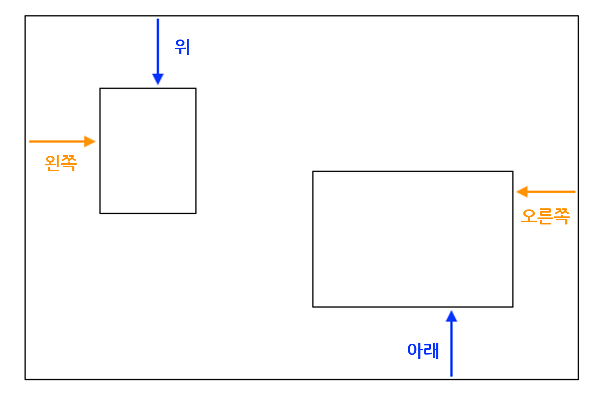

## 사진 콜라주

이번 카드에서는 HTML 요소의 포지션을 정확하게 정하는 CSS 사용법과 사진 콜라주 만드는 법을 배웁니다.


+ `div`를 자신의 페이지에 추가하고 그 안에 원하는 만큼의 사진을 넣어줍니다. `div`와 `img` 요소에 `id` 값을 부여합니다.

```html
    <div id="photoBox" class="relPos">
        
        
    </div>
```

해당 사진들은 부여한 코드에따라 웹페이지에 한 개가 나타고 다른 한 개가 나타납니다.

+ 자신의 CSS 파일에서 다음의 CSS 클래스를 `div`에 있는 요소에 추가합니다: 

```css
    .absPos {
        position: absolute;
    }
```

+ 다음으로, `position: relative;` 속성을 해당 컨테이너에 추가하고 컨테이너의 사이즈를 정의 합니다. 이 과정은 **관련된** 컨테이너로 (that is, within) 정의된 다른 요소의 위치를 만들기 위함입니다.

```css
    .relPos {
        position: relative;
    }

    #photoBox {
        width: 800px;
        height: 400px;
    }
```

+ 각각의 요소의 일련의 스타일 규칙을 **id 선택기**를 이용하여 크기(`너비`와 혹은 `높이`속성) 를 설정하기 위해 스타일 룰과 정확한 위치 역시 생성합니다.

요소의 위치를 정의내리기 위해, 사용할 수 있는 다음의 속성이 4개 있습니다: `left`, `right`, `top`, `bottom` 이것들은 부모의 가장자리로부터 각각의 가장자리가 얼마나 떨어져야 하는 지 나타냅니다. 수직 위치를 만들기 위해 `top` 혹은 `bottom`를 사용하고, `left` 혹은 `right`을 사용하여 수평위치를 만듭니다.



+ 사진 각각의 정확한 포지션을 정하고, CSS 규칙의 포지션을 정의하기 위해 `left`, `right`, `top`, `bottom` 속성들 중 사용합니다. 예를 들어, 이 코드는 고양이를 그림 위에서 부터 100픽셀, 왼쪽에서 부터 60픽셀로 배치합니다.

```css
    #imgTeaCat {
        width: 250px;
        top: 100px;
        left: 60px;
    }
```

참고: 위치 값도 음수 일 수 있습니다! 음수 값을 사용하게 되면, 요소를 컨테이너의 지정한 가장자리 밖으로 밀어냅니다.

### 사물을 겹쳐서 배치하기

일부 사진들을 겹쳐서 매치하고 싶을 수 있습니다. 하지만 하나를 위에 오도록 어떻게 선택할까요?

+ 두 이미지를 선택하고 겹치도록 위치를 부여합니다.

+ 하나에는 `z-index: 10;`를, 나머지 하나에는 `z-index: 7;`속성을 더해줍니다.

+ 웹페이지의 결과를 확인합니다.


+ `7`과 `10`을 바꾸기 위해 `z-index`값을 바꿉니다. 웹페이지 차이점을 확인할 수 있나요?


## \--- collapse \---

## title: z-index는 어떻게 작동하나요?

`z-index` 속성은 두 개이상의 요소를 겹치는 것을 결정하게 합니다. 값은 전체 값 아무거나 올 수 있습니다.

**가장 높은** 값의 요소가 **위**로 오도록 끝나고 다시 말해 제일 **앞**에 옵니다. 다음으로 높은 값의 요소가 그 뒤에 오고, 다른 것들의 앞에 옵니다. 가장 낮은 값의 요소를 얻을 때까지 반복하면 그것은 다른 요소들의 뒤에 나타나게 됩니다.

\--- /collapse \---

사진을 제외한 모든 HTML 요소에 이런 방식로 포지션을 배치할 수 있습니다. 예를 들어, `p`요소를 사진에 텍스트로 추가하기 위해 사용할 수 있습니다.

\--- challenge \---

## 도전: 콜라주 사진을 만들어봅니다.

+ 아래 보이는 것처럼 나만의 콜라주 사진을 만들어 봅시다! 원하는 방식으로 겹치기 위해 다양한 `z-index` 값으로 정확한 위치를 사용합시다.

\--- hints \---

\--- hint \---

아래에 있는 것은 저의 아일랜드 웹사이트의 콜라주 사진을 위한 HTML 코드입니다. 여섯 개의 사진이 있고 모든 `div` 안에 텍스트가 있습니다.

```html
    <div id="photoBox" class="relPos">
        
        
        
        
        
        
        <p id="photoText" class="absPos">아일랜드</p>
    </div>
```

\--- /hint \---

\--- hint \---

다음은 콜라주 안의 사진 각각의 포지션을 정하는 CSS 규칙입니다:

```css
    #imgHorse {
        width: 120px;
        top: 200px;
        left: 390px;
        z-index: 10;
    }
    #imgSheep {
        width: 200px;
        top: 100px;
        left: 20px;
        z-index: 8;
    }
    #imgCoast {
        width: 150px;
        top: 250px;
        left: 10px;
        z-index: 5;
    }
    #imgTrees {
        width: 110px;
        top: 65px;
        left: 205px;
        z-index: 9;
    }
    #imgTeaCat {
        width: 250px;
        top: 210px;
        left: 160px;
        z-index: 7;
    }
    #imgStreet {
        width: 180px;
        top: 90px;
        left: 310px;
        z-index: 6;
    }
    #photoText {
        font-family: "brush script MT";
        color: lightgreen;
        font-size: 4em;
        left: 35px;
        top: 15px;
        z-index: 20;
    }
```

\--- /hint \---

\--- hint \---

다음은 제가 사용한 CSS 클래스입니다:

```css
    .collagePhoto {
        border: 1px solid white;
    }
    .relPos {
        position: relative;
    }
    .absPos {
        position: absolute;
    }
```

\--- /hint \---

\--- /hints \---


\--- /challenge \---