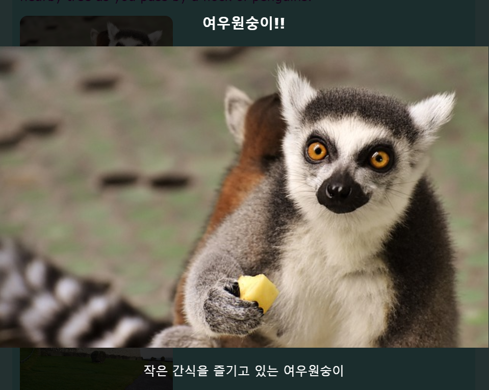

## 특수 효과

이번 카드에서는 CSS로 얻을 수 있는 더 좋은 효과 몇 개를 배울 것입니다.

### 움직임과 그림자

사전에 만들어 놓은 카드 위에 커서를 올려놓을 때 약간의 움직임을 추가해봅시다.

+ 사전에 만든 CSS 클래스에서 `.card:hover` 클래스를 찾고 찾은 클래스를 다음으로 바꿉시다:

```css
    .card:hover {
        box-shadow: 0px 2px 2px rgba(0,0,0,0.2); 
        transform: translateY(-2px);
    }
```

+ `translate`(번역) 기능에서 다양한 값을 시도합니다!

## \--- collapse \---

## title: `변형` 속성

중간 HTML/CSS 초밥 카드를 완성했다면, 몇몇의 `@keyframes` 애니메이션에서 `변형` 속성을 사용한 것을 기억할 것 입니다. 규칙적인 CSS 블럭으로 그 속성을 사용하는 것을 볼 수 있습니다.

설정할 수 있는 값 하나는 `rotate`(회전)이고, 요소가 돌아가도록 만듭니다. 다른 것들은 위아래로 움직이기 위한 `translateY`, 양 옆으로 움직이기 위한 `translateX` 입니다.

\--- /collapse \---

+ 무엇을 하는지 보기 위해 `box-shadow` 속성에서 다양한 픽셀 값으로 시도해 봅시다. 

## \--- collapse \---

## title: `rgba`란?

`rgba(0,0,0,0.2)`는 색깔을 정의하는 또 다른 방법입니다.

그것은 빨강, 초록, 파랑을 나타내는 일반 숫자 세 개(`0`에서 `255`까지) 를 포함한다.

**alpha** 값이라고하는 네 번째 숫자는 어떤 대상이 **투명**한지 정의합니다. `0` 에서 `1`사이의 십진수로, `1`은 전혀 투명하지 않고, `0` 은 아예 보이지 않습니다. 즉, 요소의 알파 값이 낮을수록 투명도가 높아집니다.

\--- /collapse \---

+ `.card` 클래스에 다음 속성을 추가하여 움직임을 매끄럽게 만듭니다. 

```css
    transition: all 0.2s ease-out;
```

지속 시간 `0.2s`는 `transition`(전환) 이 0.2초 동안 지속됨을 의미합니다.

### 라이트 박스

많은 웹 사이트에서 볼 수 있는 또 다른 효과는 **라이트 박스**입니다: 무언가를 클릭하면 웹 사이트가 어두워지고 더 큰 사진이나 팝업 상자 같은 다른 것이 모든 항목 앞으로 나타납니다.



이 효과를 얻으려면 두 개의 링크를 만듭니다. 하나는 실제 라이트 박스(앞으로 나오는 비트)에 대한 링크이고 다른 하나는 라이트 박스를 나타나게 하기 위해 클릭하는 링크입니다. 저는 제 웹 사이트의 관광 명소 페이지에서 제 작업을 해보겠습니다. 사진이 있는 어떤 페이지로든 이동합니다!

+ 클릭 할 때 어떤 항목이 나타나길 원하는지 결정하고, 일련의 `a` 태그 사이에 페이지에 항목 모두 추가하여 링크를 만듭니다. `id`를 등록했는지 확인하세요. 그 코드는 페이지의 어느 곳이든 갈 수 있습니다: 다음 단계에서는 요소를 보이지 않게 만들어 보겠습니다!

```html
    <a href="#_" class="lightbox" id="boxLemur">
        <h3>여우 원숭이!!</h3>
        
        <p>작은 간식을 즐기고 있는 여우 원숭이</p>
    </a>
```

링크 태그 사이에 원하는 것을 넣을 수 있습니다. 큰 사진, 제목 및 텍스트가 있습니다. 텍스트 없이 사진만 올리기를 원할 수도 있습니다!

+ 라이트 박스에 다음의 CSS 코드를 추가합니다. 이중 무엇이 작동시키는지 알겠습니까?

```css
    .lightbox{
        background: rgba(0,0,0,0.8);
        color: #ffffff;
        text-align: center;
        text-decoration: none;
        width: 100%;
        height: 100%;
        top: 0;
        left: 0;
        position: fixed;
        visibility: hidden;
        z-index: 999;
    }
```

참고: `position` 속성을 `fixed`로 설정하면 설정 한 위치가 브라우저 창에 따라 설정되기 때문에, 스크롤 할 때 그대로 유지됩니다.

+ 다음으로 라이트 박스를 표시하기 위해 클릭 할 항목을 결정하고, 요소 주변에 `a` 태그 쌍을 추가합니다 (제 경우에는 여우 원숭이 작은 사진입니다). 링크의 **객체**는 `id`를 사용하여 설정한 라이트 박스가됩니다. 이 기술을 원래 알고 있었을 수 있습니다!

```html
    <a href="#boxLemur">
      
  </a>
```

+ 마지막으로 다음의 CSS 코드를 추가합니다. 이것은 **pseudo-class**입니다; `.lightbox` 클래스 내부가 아니라 코드 뒤에 들어가야합니다.

```css
    .lightbox:target {
        visibility: visible;
    }
```

`:target` pseudo-class 라이트 박스가 마지막으로 클릭 된 링크의 객체가 될 때마다 적용됩니다. 따라서 아무 곳이나 클릭하면, `visibility`는 `hidden` 으로 설정될 것입니다.

+ 라이트 박스가 나타나는지 확인하려면 새 링크를 클릭하세요! 사라지게 하려면 페이지의 아무 곳이나 클릭하세요.

페이지에 원하는만큼 라이트 박스를 추가 할 수 있습니다. 모두 동일한 CSS 클래스를 사용할 수 있습니다. 단, 각 클래스가 서로 다른 `id`를 갖도록 설정하세요! 각각에 대해 웹 페이지에서 라이트 박스를 표시하기 위해 링크로 연결된 객체를 만든 다음, 위에서 한 것 처럼, 해당 링크의 `href` 값으로써 `id`를 사용하세요.