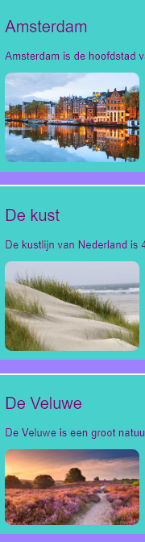
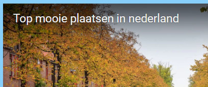
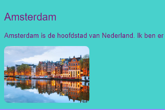
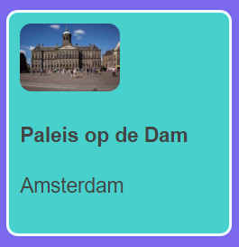

## Klikbare kaarten

Hier is een techniek die je kunt gebruiken om een ​​fotogalerij te maken of een portfolio-pagina die je projecten laat zien: kleine **voorbeeldkaarten**.



+ Voeg de volgende HTML-code waar je maar wilt aan je website toe. Ik doe het in `index.html`. Je kunt de afbeelding en tekst aanpassen aan je eigen voorbeeldkaarten. Ik ga een aantal hoogtepunten van de toeristische attracties in Ierland doen.

```html
    <article class="card">
        
        <h3>Fota Wildlife Park</h3>
        <p>Fota Island, County Cork</p>
    </article>
```



+ Voeg de volgende CSS-code toe om de klassen `card` en `tinyPicture` te maken:

```css
    .tinyPicture {
        height: 60px;
        border-radius: 10px;
    }
    .card {
        width: 200px;
        height: 200px;
        border: 2px solid #F0FFFF;
        border-radius: 10px;
        box-sizing: border-box;
        padding: 10px;
        margin-top: 10px;
        font-family: "Trebuchet MS", sans-serif;
    }
    .card:hover {
        border-color: #1E90FF;
    }
```



Laten we de hele voorbeeldkaart in een link veranderen zodat mensen kunnen klikken om meer informatie te zien.

+ Plaats het hele `article` element binnen een link element. Zorg ervoor dat de `</a>` tag na het `</article>` label komt! Je kunt de **URL** link veranderen naar wat je maar wilt linken. Dat zou een andere pagina op je website kunnen zijn, of het zou helemaal een andere website kunnen zijn.

```html
    <a href="attractions.html#scFota">  
        <article class="card ">
            
            <h3>Fota Wildlife Park</h3>
            <p>Fota Island, County Cork</p>
        </article>
    </a>
```



## \--- collapse \---

## title: koppelen aan een specifiek gedeelte van een pagina

Zie je hoe de waarde van `href` in mijn link eindigt op `#scFota`? Dit is een handige truc die je kunt gebruiken om naar een bepaald deel van een pagina te gaan.

+ Typ eerst de URL van de pagina waarnaar je wilt linken, gevolgd door `#`.

+ Vind in de code voor de pagina waarnaar je koppelt het deel waarnaar je wilt springen en geef dat element een `id`, bijvoorbeeld `<sectieid="scFota"`. De waarde van de `id` is wat je typt na de `#` in je link.

\--- /collapse \---

## \--- collapse \---

## title: stijlen opnieuw instellen

Nu de hele voorbeeldkaart een koppeling is, is het lettertype mogelijk gewijzigd.

+ Als dat het geval is, kun je dit oplossen door een **CSS klasse** aan de link toe te voegen: `class="cardLink"`. Hier is de CSS-code die je in je stylesheet kunt zetten:

```css
    .cardLink {
        color: inherit;
        text-decoration: none;
    }
```

Het instellen van de waarde van een eigenschap op `inherit` (erven) zorgt ervoor dat het de waarde van het **parent** element krijgt. In dit geval komt de tekstkleur overeen met de rest van de tekst op de startpagina.

\--- /collapse \---

+ Maak minimaal vier of vijf van deze kaarten. Als je werkt vanuit mijn voorbeeld website, kun je er een doen voor elk van de secties op de pagina Attracties. Met de volgende Sushi Card leer je hoe je de kaarten kunt rangschikken met een coole truc!