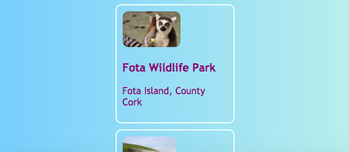
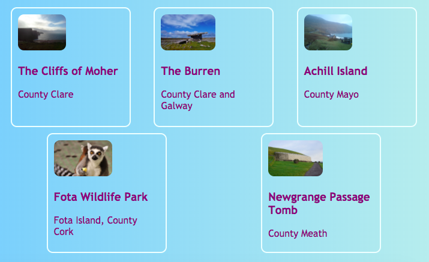
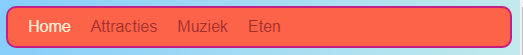
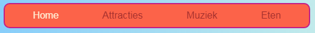
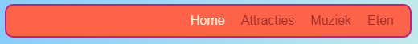

## Alles op één rij

Met deze kaart leer je wat trucs om dingen **horizontaal** op een pagina te ordenen. Eerst zul je zien hoe je dingen gecentreerd kunt krijgen. Vervolgens rangschik je elementen naast elkaar.

+ Voeg de volgende CSS-eigenschap toe aan je `.card` class:

```css
    margin-left: auto;
    margin-right: auto;
```

Je zou moeten zien dat de kaarten naar het midden van de pagina gaan. Door de linker- en rechtermarge in te stellen op `auto` (automatisch), kun je elk element in het midden plaatsen in plaats van aan de linkerkant.



+ Versleep de rand van het browservenster om de pagina smaller en breder te maken - zie je dat de kaarten gecentreerd blijven.

+ Zet alle kaart links die je zojuist hebt gemaakt in een nieuw containerelement. Het wordt geen `article` of een `section`, maar eentje met de naam `div`. Dit is een container voor algemene doeleinden die je kunt gebruiken om dingen te groeperen en mooie layouts te maken.

```html
    <div class="cardContainer">
```

+ Voeg de volgende code aan je style sheet toe:

```css
    .cardContainer {
        display: flex;
        flex-wrap: wrap;
        justify-content: space-around;
        padding: 10px;
    }
```

Voila! Met dank aan **Flex**, je kaarten worden nu naast elkaar weergegeven!

+ Versleep de rand van je venster om de website breder en smaller te maken en kijk hoe de kaarten zich verplaatsen om in de venstergrootte te passen, soms omslaand naar de volgende regel.



+ Probeer de `width` en de `height` eigenschappen te verwijderen van de `.card` klasse en zie wat er gebeurt: `flex` past de kaarten als een legpuzzel slim aan elkaar en houdt een gelijkmatige hoogte aan voor alles dat zich in dezelfde rij bevindt.


Als je een navigatiemenu boven aan je pagina hebt, kun je dit trucje ook gebruiken. Je menu moet samengesteld zijn uit lijstelementen( (`li`) voor dit volgende stukje. Als je wilt, kun je het uitproberen met mijn website.

+ Zoek de CSS-regels voor het menu. In mijn website zijn dat de blokken `nav ul`, `nav ul li` en `nav ul li a`.

+ Verwijder de eigenschap `display:inline;` uit de lijst items. Vervolgens, in de lijst `nav ul`, toevoegen:

```css
    display: flex;
    justify-content: flex-start;
```



Je krijgt uiteindelijk vrijwel hetzelfde menu, toch? Het leuke van `flex` is dat je de lay-out met de eigenschap `justify-content` kunt regelen.

+ Wijzig de waarde van `justify-content` naar `flex-end` en kijk wat er gebeurt. Of verander het naar `space-around` om de menu-items gelijkmatig uit elkaar te plaatsen, net als voor de kaarten.





**`flex`** is een behoorlijk krachtige lay-out gereedschap die een hele Sushi Kaart-serie zou kunnen vullen --- je kunt er meer over leren op [dojo.soy/html3-flex](http://dojo.soy/html3-flex).