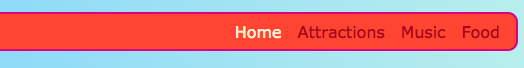

## Pas je menu automatisch aan

Een **responsive** website is er een die zich aanpast aan de schermgrootte zodat het er altijd fantastisch uitziet, of je het nu bekijkt op een computer, mobiele telefoon of tablet. Laat je menu zich automatisch aanpassen!

Je begint met de reguliere stijlen: dit is je **default** (standaard) gedrag.

--- collapse ---
---
title: Wat betekent 'default'?
---

De default (standaard) stijlen zijn je normale set stijlregels. Ze worden, voordat er speciale voorwaarden worden gecontroleerd, altijd toegepast,.

Je kunt code toevoegen die vervolgens de grootte van het scherm controleert en indien nodig enkele aanpassingen aanbrengt.

--- /collapse ---

+ Voeg de volgende CSS-regels toe aan je menu. Je hebt waarschijnlijk ook kleuren en randen gedefinieerd; Ik heb ze weggelaten om hier ruimte te sparen! Als je al CSS-regels hebt gedefinieerd voor jouw menu, hoef je alleen maar de eigenschappen en waarden die je mist hieronder toe te voegen of te wijzigen.

```css
    nav ul {
        padding: 0.5em;
        display: flex;
        flex-direction: column;
    }
    nav ul li {
        text-align: center; 
        list-style-type: none;
        margin-right: 0.5em;
        margin-left: 0.5em;
    }
```

Met de bovenstaande CSS-code is je menu het meest geschikt voor kleine schermen. Dit wordt **mobile-first** (mobiel-eerst) genoemd.


--- collapse ---
---
title: Wat betekent 'mobile-first'?
---

Heel vaak gebruik je bij het coderen van een website een computerscherm en je zult waarschijnlijk jouw stijlen definiëren op basis van hoe het eruit ziet op dat scherm.

Wanneer je codeert voor mobile first, kies je in plaats daarvan standaard stijlen die geschikt zijn voor kleine schermen zoals smartphones. Je voegt vervolgens extra code toe om aanpassingen aan te brengen voor grotere schermen.

Aangezien steeds meer mensen op hun smartphone of tablet op het internet browsen in plaats van op een computer, is het een goede gewoonte om je website met dit in gedachten te ontwikkelen.

--- /collapse ---

+ Voeg nu de volgende code aan je style sheet toe:

```css
    @media all and (min-width: 1000px) {
        nav ul {
            flex-direction: row;
            justify-content: space-around;
        }
    }
```

De eerste regel code hierboven controleert welke grootte het browservenster heeft. Als het venster **1000 pixels** of meer breed is, worden alle stijlregels binnen het blok toegepast.


--- collapse ---
---
title: Hoe werkt het?
---

Het blok bevat nieuwe waarden voor slechts enkele eigenschappen van het `nav ul` menu.

Telkens wanneer het venster breder is dan 1000 pixels, worden deze nieuwe waarden toegepast in plaats van degene die je al hebt gedefinieerd voor `nav ul`.

De rest van de eigenschappen die je eerder hebt gedefinieerd voor `nav ul` zullen hetzelfde blijven.

--- /collapse ---

+ Als je Trinket gebruikt om code te schrijven, kan het handig zijn om het project te downloaden, zodat je het kunt uitproberen op een volledig scherm.

--- challenge ---

## Uitdaging: laat je menu zich aanpassen voor grote schermen

+ Kun je nog een blok toevoegen voor schermen die groter zijn dan **1600 pixels**, met `flex-end` in plaats van `space-around`?



--- hints ---


--- hint ---

De volgende code definieert flex-eigenschappen voor menu items wanneer het scherm groter is dan 1600 pixels:

```css
    @media all and (min-width: 1600px) {
        nav ul {
            flex-direction: row;
            justify-content: flex-end;
        }
    }  
```

--- /hint ---

--- /hints ---

--- /challenge ---

Je kunt CSS-regels die je leuk vindt in dergelijke blokken plaatsen om verschillende stijlen voor verschillende schermformaten te definiëren. Het is vooral handig wanneer je later CSS raster layouts doet!