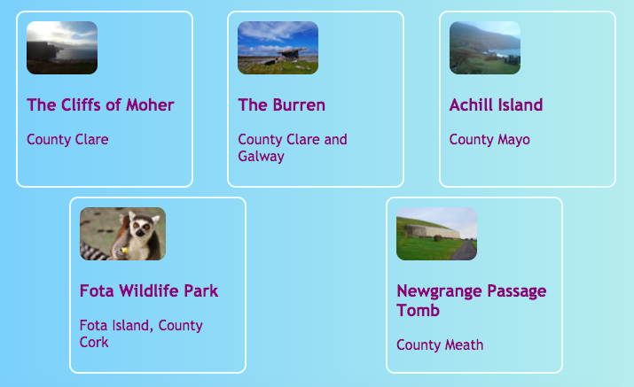

## Alles op één rij

Met deze kaart leer je wat trucs om dingen **horizontaal** op een pagina te ordenen. Eerst zul je zien hoe je dingen gecentreerd kunt krijgen. Vervolgens rangschik je elementen naast elkaar.

+ Voeg de volgende CSS-eigenschap toe aan je `.card` class:

```css
    margin-left: auto;
    margin-right: auto;
```

Je zou moeten zien dat de kaarten naar het midden van de pagina gaan. Door de linker- en rechtermarge in te stellen op `auto` (automatisch), kun je elk element in het midden plaatsen in plaats van aan de linkerkant.


+ Versleep de rand van het browservenster om de pagina smaller en breder te maken - zie je dat de kaarten gecentreerd blijven.

+ Zet alle kaart links die je zojuist hebt gemaakt in een nieuw containerelement. Het wordt geen `article` of een `section`, maar eentje met de naam `div`. Dit is een container voor algemene doeleinden die je kunt gebruiken om dingen te groeperen en mooie layouts te maken.

```html
    <div class="cardContainer">
```

+ Voeg de volgende code aan je style sheet toe:

```css
    .cardContainer {
        display: flex;
        flex-wrap: wrap;
        justify-content: space-around;
        padding: 10px;
    }
```

Voila! Met dank aan **Flex**, je kaarten worden nu naast elkaar weergegeven!

+ Versleep de rand van je venster om de website breder en smaller te maken en kijk hoe de kaarten zich verplaatsen om in de venstergrootte te passen, soms omslaand naar de volgende regel.



+ Try deleting the `width` and `height` properties from the `.card` class and see what happens: `flex` cleverly fits the cards together like a jigsaw puzzle, keeping an even height across everything that's in the same row.


If you have a navigation menu at the top of your page, that's another place you can use this trick. Your menu needs to be composed of list elements( (`li`) for this next bit. If you prefer, you can try it out with my website.

+ Find the CSS rules for the menu. In my website, that's the blocks `nav ul`, `nav ul li`, and `nav ul li a`.

+ Delete the property `display: inline;` from the list items. Then, in the list `nav ul`, add in:

```css
    display: flex;
    justify-content: flex-start;
```


You end up with pretty much the same menu, right? The cool thing about `flex` is you can control the layout with the property `justify-content`.

+ Change the value of `justify-content` to `flex-end` and see what happens. Or change it to `space-around` to make the menu items evenly spaced, just like you did for the cards.


**`flex`** is a pretty powerful layout tool that could fill a whole Sushi Card series of its own — you can learn more about it at [dojo.soy/html3-flex](http://dojo.soy/html3-flex).