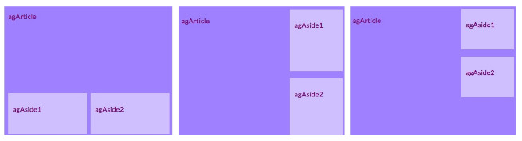
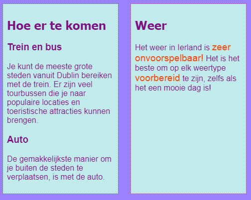
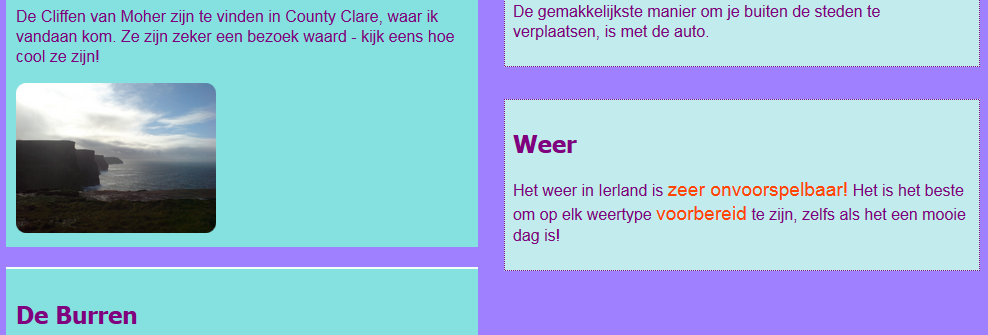
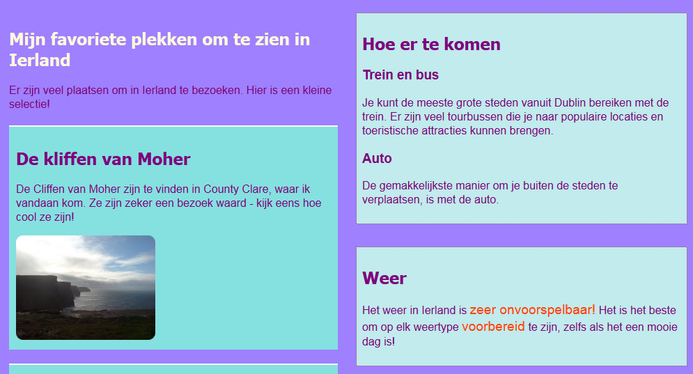

## Ontwerp coole pagina-layouts

+ Voor deze kaart zou je moeten werken met een pagina die een `main` element bevat met daarbinnen drie elementen: één `article` en twee `aside` elementen. Ga je gang en maak deze eerst als dat nodig is. Als je met mijn website wilt werken, voeg je de `aside` code van de vorige Sushi Card toe aan de Attracties pagina. 

Hier zijn drie verschillende pagina layouts die je gaat toepassen:



+ Voeg nieuwe CSS klassen toe aan `main` en elk van de drie elementen daarbinnen.

```html
    <main class="attPageLayoutGrid">
        <article class="attGridArticle">
            <!--andere dingen hier-->
        </article>
        <aside class="attGridAside1">
            <!--andere dingen hier-->
        </aside>
        <aside class="attGridAside2">
            <!--andere dingen hier-->
        </aside>
    </main>
```

De container waarvan je de indeling wijzigt is `main`, maar je zou dit kunnen doen met elke soort container, zoals een `div` of `article`, of zelfs voor de hele pagina `body`. De techniek die je gaat gebruiken, wordt het ** CSS-grid** genoemd.

In dit voorbeeld worden de `header` (kop) en `footer` (voettekst) weggelaten uit het ontwerp, maar het is vrij normaal om ze ook in het raster op te nemen.

+ Stel de `display` eigenschap voor de gehele container in op `grid`:

```css
    .attPageLayoutGrid {
        display: grid;
        grid-column-gap: 0.5em;
        grid-row-gap: 1em;
    }
```

Wat denk je dat de `grid-column-gap` en `grid-row-gap` eigenschappen doen?

+ Vervolgens benoem je een `grid-area` (rastergebied) voor elk element: 

```css
    .attGridArticle {
        grid-area: agArticle;
    }
    .attGridAside1 {
        grid-area: agAside1;
    }
    .attGridAside2 {
        grid-area: agAside2;
    }
```

Dan ontwerp je jouw layout! Laten we de twee `aside` elementen naast elkaar onderaan de pagina zetten. Hiervoor heb je twee **colums** (kolommen) van gelijke breedte nodig. Je kunt de **rij** hoogte automatisch laten.

+ Plaats de volgende code binnenin de `.attPageLayoutGrid` CSS regels:

```css
    grid-template-rows: auto;
    grid-template-columns: 1fr 1fr;
    grid-template-areas: 
        "agArticle agArticle"
        "agAside1 agAside2";
```

`fr` staat voor **fraction** (deel). Let op hoe je het `article` alle ruimte over de twee kolommen in beslag laat nemen.

## \--- collapse \---

## title: Help! Ik kreeg fouten en waarschuwingen!

Als je Trinket gebruikt, kunnen er enkele fouten (errors) en waarschuwingen (warnings) verschijnen, zelfs als je de code precies zo hebt getypt als hierboven. Dit komt omdat Trinket de CSS raster eigenschappen nog niet herkent. Echter, de code werkt wel.

Als de CSS raster code jou 'unknown property'-waarschuwingen geeft of een fout als 'unexpected token 1fr' geeft, kun je deze eenvoudigweg negeren.

\--- /collapse \---



Laten we de `aside` elementen aan de rechterkant zetten en ze de halve breedte van het `article` maken.

+ Wijzig de waarden van `grid-template-columns` en `grid-template-areas`naar:

```css
    grid-template-columns: 2fr 1fr;
    grid-template-areas: 
        "agArticle agAside1"
        "agArticle agAside2";
```



+ Als je de `aside` elementen niet helemaal naar beneden wilt uittrekken, kun je een lege ruimte toevoegen met behulp van een punt: 

```css
    grid-template-areas: 
        "agArticle agAside1"
        "agArticle agAside2"
        "agArticle . ";
```



\--- challenge \---

## Uitdaging: maak verschillende layouts voor verschillende schermformaten

+ Can you use the screen size checks you added earlier to make the layout change depending on how wide the screen is? Note: if you already created CSS blocks for each screen size, you can add the new CSS code to those blocks instead of creating new ones.

\--- hints \---

\--- hint \---

The following code defines a layout for the CSS class above when the screen is bigger than 1000 pixels:

```css
    @media all and (min-width: 1000px) {
        .attPageLayoutGrid {
            grid-template-columns: 1fr 1fr;
            grid-template-areas: 
                "agArticle agArticle"
                "agAside1 agAside2";
        }
    }  
```

\--- /hint \---

\--- hint \---

The following code defines a layout for the CSS class above when the screen is bigger than 1600 pixels:

```css
    @media all and (min-width: 1600px) {
        .attPageLayoutGrid {
            grid-template-columns: 1fr 1fr;
            grid-template-areas: 
                "agArticle agAside1"
                "agArticle agAside2"
                "agArticle .";
        }
    }  
```

\--- /hint \---

\--- /hints \---

\--- /challenge \---

With **CSS grid**, you can make almost any layout you like. If you want to learn more, go to [dojo.soy/html3-css-grid](http://dojo.soy/html3-css-grid){:target="_blank"}