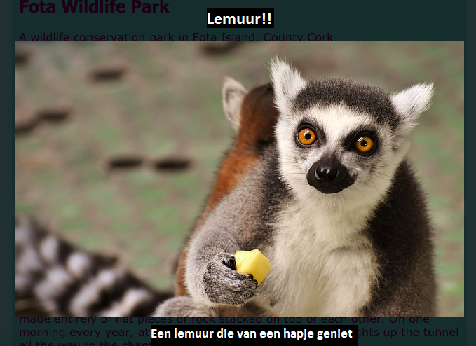

## Speciale effecten

Op deze kaart leer je een paar leuke effecten die je met CSS kunt bereiken.

### Schaduwen en beweging

Laten we een kleine beweging toevoegen als je jouw muisaanwijzer over de kaarten, die je eerder hebt gemaakt, laat gaan.

+ Vind de `.card:hover` CSS klasse van eerder en verander het naar het volgende:

```css
    .card:hover {
        box-shadow: 0px 2px 2px rgba(0,0,0,0.2); 
        transform: translateY(-2px);
    }
```

+ Probeer verschillende waarden uit in de `translate` functie!

--- collapse ---
---
title: de `transform` eigenschap
---

Als je de Intermediate HTML/CSS Sushi Kaarten hebt voltooid, weet je wellicht nog dat je de `transform` eigenschap in sommige `@keyframes` animaties hebt gebruikt. Hier zie je dat je de eigenschap ook kunt gebruiken in een standaard CSS-blok.

Een waarde die je kunt gebruiken is `rotate` (draaien), om een ​​element te laten draaien. Andere zijn `translateY`, dat iets naar boven of naar onder verplaatst, en `translateX`, voor beweging van links naar rechts.

--- /collapse ---

+ Speel met verschillende pixelwaarden in de `box-shadow` eigenschap om te zien wat ze doen. 

--- collapse ---
---
title: Wat is `rgba`?
---

`rgba(0,0,0,0.2)` is een andere manier om een ​​kleur te definiëren.

Het heeft de gebruikelijke drie nummers (van `0` tot `255`) voor rood, groen en blauw.

Het vierde nummer, de **alpha** waarde, definieert hoe **transparant** (of doorzichtig) iets is. Het is een decimaal getal tussen `0` en `1`, met `1` geheel ondoorzichtig, en `0` volledig doorzichtig. Dit betekent dat hoe lager de alpha waarde van een element, hoe doorzichtiger het is.

--- /collapse ---

+ Maak tenslotte de beweging vloeiend door de volgende eigenschap aan de `.card` class van eerder toe te voegen: 

```css
    transition: all 0.2s ease-out;
```

Een tijd van `0,2s` betekent dat de `transition` (overgang) 0,2 seconden duurt.

### Lightbox

Een ander effect dat je waarschijnlijk op veel websites hebt gezien, is **lightbox**: je klikt ergens op en de website dimt terwijl iets anders, zoals een grotere afbeelding of een pop-up venster ervoor verschijnt.



Om dit effect te krijgen, maak je twee links: één voor de daadwerkelijke lightbox (het ding dat verschijnt) en één voor het ding dat je klikt om de lightbox te laten verschijnen. Ik ga de mijne op de pagina Attracties van mijn website zetten. Ga naar een pagina waarop je foto's hebt staan!

+ Bepaal welke dingen je wilt weergeven wanneer je klikt en voeg ze allemaal toe aan jouw pagina tussen een set van `a` tags om een ​​link te maken. Zorg ervoor dat je de link een `id` geeft. De code kan overal op de pagina verschijnen: je zult de elementen in de volgende stap onzichtbaar maken!

```html
    <a href="#_" class="lightbox" id="boxLemur">
        <h3>Lemur!!</h3>
        
        <p>Een maki die van een kleine snack geniet</p>
    </a>
```

Je kunt alles wat je wilt tussen de link tags plaatsen. Ik heb een grote foto, een titel en wat tekst. Misschien wil je gewoon een foto en geen tekst!

+ Voeg de volgende CSS-code toe voor de lightbox. Kun jij uitvinden wat een deel ervan doet?

```css
    .lightbox{
        background: rgba(0,0,0,0.8);
        color: #ffffff;
        text-align: center;
        text-decoration: none;
        width: 100%;
        height: 100%;
        top: 0;
        left: 0;
        position: fixed;
        visibility: hidden;
        z-index: 999;
    }
```

Opmerking: de positie `position` eigenschap op `fixed` zetten betekent dat de positie die je instelt relatief is ten opzichte van het browservenster, zodat deze blijft staan ​​wanneer je scrollt.

+ Bepaal vervolgens welk ding je wilt aanklikken om de lightbox te laten verschijnen en voeg een paar `a` tags rond dat element toe (in mijn geval is het een kleinere afbeelding van een maki). Het **target** (doel) van de link wordt de lightbox, die je instelt met behulp van de `id`. Je herkent deze techniek misschien van eerder!

```html
    <a href="#boxLemur">
        
    </a>
```

+ Voeg ten slotte de volgende CSS-code toe. Merk op dat dit een **pseudo-class** is; het zou achter de code voor de `.lightbox` class moeten komen en niet erin!

```css
    .lightbox:target {
        visibility: visible;
    }
```

De `:target` pseudo-klasse wordt toegepast als de lightbox het doelwit was van de laatste geklikte koppeling. Dus wanneer je ergens klikt, wordt de `visibility` teruggezet naar `hidden` (verborgen).

+ Klik op je nieuwe link om de lightbox te zien verschijnen! Klik ergens op de pagina om het te laten verdwijnen.

Je kunt zoveel lightboxen aan een pagina toevoegen als je wilt. Ze kunnen allemaal dezelfde CSS-klasse gebruiken - zorg er alleen voor dat elke code een andere `id` heeft! Voor elke pagina moet je iets op je webpagina maken in een koppeling waarop je kunt klikken om de lightbox weer te geven en vervolgens de `id` als de `href` waarde in die link gebruiken, net zoals je hierboven hebt gedaan!