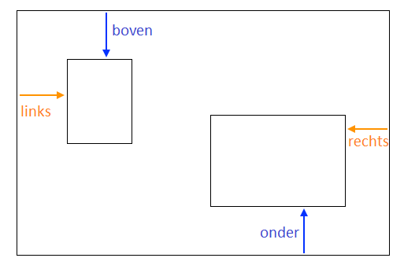

## Foto collage

Op deze kaart leer je CSS te gebruiken om HTML-elementen precies te positioneren en een fotocollage te maken.


+ Voeg een `div` toe aan je pagina en plaats er zoveel afbeeldingen in als je maar wilt. Geef de `div` en `img` elementen `id` waarden.

```html
    <div id="photoBox" class="relPos">
        
        
    </div>
```

De foto's verschijnen één na één op de webpagina, in de volgorde waarin ze in je code voorkomen.

+ Voeg in je CSS bestand de volgende CSS klasse toe voor de elementen binnen de `div`: 

```css
    .absPos {
        position: absolute;
    }
```

+ Vervolgens moet je de eigenschap `position: relative;` aan de container zelf toevoegen en definieer daar een grootte voor. Dit maakt het zo dat de posities van de andere elementen **relatief tot** (dat wil zeggen, binnenin) de container worden gedefinieerd.

```css
    .relPos {
        position: relative;
    }

    #photoBox {
        width: 800px;
        height: 400px;
    }
```

+ Maak vervolgens een set stijl regels voor elk van de elementen met behulp van **id-selectors** om hun maten (`width` en/of `height` eigenschappen) en hun exacte posities in te stellen.

Om de positie van een element te bepalen, zijn er vier eigenschappen die je kunt gebruiken: `left`, `right`, `top` en `bottom`. Zij geven aan hoe ver elk van de randen van de rand van het parent element af moet liggen. Gebruik `top` of `bottom` voor de verticale positie en `left` of `right` voor de horizontale positie.



+ Kies de exacte posities voor elk van je afbeeldingen en gebruik een van de eigenschappen `left`, `right`, `top` en `bottom` om die posities in je CSS-regels te definiëren. Bijvoorbeeld plaatst deze code de kat foto 100 pixels vanaf de bovenkant en 60 pixels van links:

```css
    #imgTeaCat {
        width: 250px;
        top: 100px;
        left: 60px;
    }
```

Opmerking: de positie waarden kunnen ook negatief zijn! Als je een negatieve waarde gebruikt, wordt het element buiten de container geduwd, over de rand die je hebt opgegeven.

### Dingen laten overlappen

Je wilt misschien sommige afbeeldingen overlappen. Maar hoe kies je welke er bovenop komt?

+ Kies twee afbeeldingen en geef ze posities waardoor ze elkaar overlappen.

+ Voeg een extra eigenschap toe, `z-index: 10;` aan een van hen en voeg vervolgens `z-index: 7;` aan de andere toe.

+ Bekijk het resultaat op je webpagina.


+ Wissel nu de `z-index` waarden om, zodat de `7` en de `10` omgewisseld zijn. Zie je enig verschil op je webpagina?


## \--- collapse \---

## title: Hoe werkt het?

De `z-index` eigenschap laat je bepalen hoe twee of meer elementen elkaar moeten overlappen. De waarde kan elk geheel getal zijn.

Het element met het **hoogste** nummer eindigt **bovenaan** de stapel, met andere woorden helemaal **bovenop**. Het element met het volgende hoogste getal ligt daaronder en bovenop de anderen, enzovoort, totdat je bij het element met het laagste getal komt, dat onderaan alle andere elementen verschijnt.

\--- /collapse \---

Je kunt niet alleen afbeeldingen op deze manier positioneren, maar alle HTML-elementen. Je kunt bijvoorbeeld een `p` element gebruiken om tekst over een foto toe te voegen.

\--- challenge \---

## Uitdaging: maak een fotocollage

+ Probeer je eigen fotocollage zoals hieronder getoond, samen te stellen! Gebruik exacte positionering samen met verschillende `z-index` waarden om het overlappende effect te krijgen zoals jij het wilt.

\--- hints \---

\--- hint \---

Hieronder staat de HTML-code voor de fotocollage op mijn Ierland-website. Er zijn zes foto's en een stuk tekst allemaal binnen een `div`.

```html
    <div id="photoBox" class="relPos">
        
        
        
        
        
        
        <p id="photoText" class="absPos">Ireland</p>
    </div>
```

\--- /hint \---

\--- hint \---

Hier zijn de CSS-regels die de posities instellen voor elk van mijn afbeeldingen in de collage:

```css
    #imgHorse {
        width: 120px;
        top: 200px;
        left: 390px;
        z-index: 10;
    }
    #imgSheep {
        width: 200px;
        top: 100px;
        left: 20px;
        z-index: 8;
    }
    #imgCoast {
        width: 150px;
        top: 250px;
        left: 10px;
        z-index: 5;
    }
    #imgTrees {
        width: 110px;
        top: 65px;
        left: 205px;
        z-index: 9;
    }
    #imgTeaCat {
        width: 250px;
        top: 210px;
        left: 160px;
        z-index: 7;
    }
    #imgStreet {
        width: 180px;
        top: 90px;
        left: 310px;
        z-index: 6;
    }
    #photoText {
        font-family: "brush script MT";
        color: lightgreen;
        font-size: 4em;
        left: 35px;
        top: 15px;
        z-index: 20;
    }
```

\--- /hint \---

\--- hint \---

Dit zijn de CSS-klassen die ik heb gebruikt:

```css
    .collagePhoto {
        border: 1px solid white;
    }
    .relPos {
        position: relative;
    }
    .absPos {
        position: absolute;
    }
```

\--- /hint \---

\--- /hints \---


\--- /challenge \---