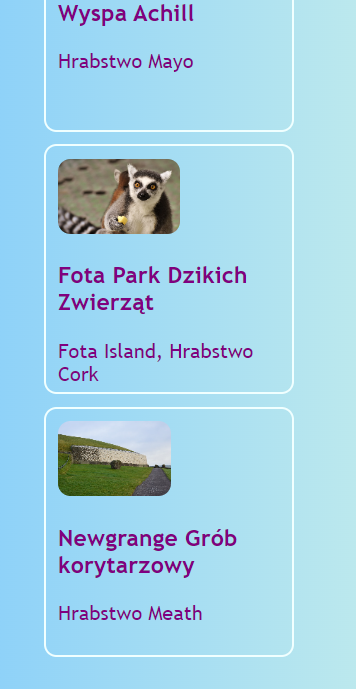
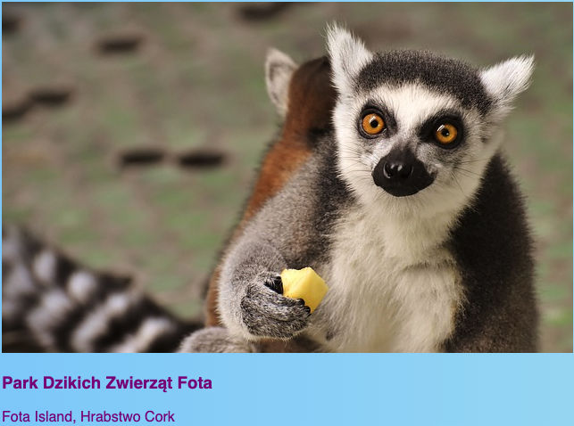
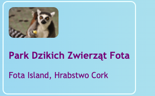
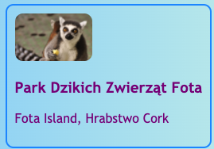

## Klikalne karty

Oto technika, za pomocą której możesz utworzyć galerię zdjęć lub stronę z portfolio przedstawiającą twoje projekty: małe **karty podglądu**.



+ Dodaj następujący kod HTML do swojej witryny, gdziekolwiek chcesz. Mój robię w pliku `index.html`. Możesz zmienić obraz i tekst, aby pasowały do Twoich kart podglądu. Zrobię kilka przykładów atrakcji turystycznych w Irlandii.

```html
    <article class="card">
        
        <h3>Park Dzikich Zwierząt Fota </h3>
        <p>Fota Island, Hrabstwo Cork</p>
    </article>
```



+ Dodaj następujący kod CSS, aby utworzyć klasy `karta` i `miniaturka`:

```css
    .tinyPicture {
        height: 60px;
        border-radius: 10px;
    }
    .card {
        width: 200px;
        height: 200px;
        border: 2px solid #F0FFFF;
        border-radius: 10px;
        box-sizing: border-box;
        padding: 10px;
        margin-top: 10px;
        font-family: "Trebuchet MS", sans-serif;
    }
    .card:hover {
        border-color: #1E90FF;
    }
```



Zamieńmy całą kartę podglądu w link, aby ludzie mogli kliknąć i zobaczyć więcej informacji.

+ Umieść cały element `artykuł` wewnątrz elementu linku. Upewnij się, że zamykający znacznik `</a>` jest po zamykającym znaczniku `</article>`! Możesz zmienić link **URL** na dowolny inny, do którego chcesz linkować. To może być inna strona na Twojej stronie internetowej lub może to być zupełnie inna strona internetowa.

```html
    <a href="attractions.html#scFota">  
        <article class="card ">
            
            <h3>Park Dzikich Zwierząt Fota</h3>
            <p>Fota Island, Hrabstwo Cork</p>
        </article>
    </a>
```



## \--- collapse \---

## title: Linkowanie do określonej części strony

Zauważ, że wartość `href` w moim linku kończy się za `#scFota`? To jest fajna sztuczka którą możesz użyć, aby przejść do konkretnej części strony.

+ Najpierw wpisz adres URL strony, z którą chcesz się połączyć, a następnie `#`.

+ W pliku kodu strony, do której prowadzi łącze, znajdź część, do której chcesz przejść, i nadaj temu elementowi `identyfikator`, na przykład `<section id="scFota”`. Wartość `identyfikatora` jest tym, co wpisujesz po `#` w Twoim linku.

\--- /collapse \---

## \--- collapse \---

## title: Resetowanie stylów

Teraz gdy cała karta podglądu jest linkiem, czcionka tekstu mogła ulec zmianie.

+ Jeśli tak, możesz to naprawić, dodając **klasę CSS** do linku: `class="cardLink"`. Oto kod CSS do umieszczenia w arkuszu stylów:

```css
    .cardLink {
        color: inherit;
        text-decoration: none;
    }
```

Ustawianie wartości dowolnej właściwości na `dziedziczenie` sprawia, że używa wartości **nadrzędnego** elementu. Tak więc w tym przypadku kolor tekstu będzie odpowiadał pozostałej części tekstu na stronie głównej.

\--- /collapse \---

+ Wykonaj co najmniej cztery lub pięć z tych kart. Jeśli pracujesz z mojej przykładowej strony internetowej, możesz zrobić jedną dla każdej sekcji na stronie Atrakcji. Na następnej karcie Sushi nauczysz się jak zorganizować karty za pomocą fajnego triku!