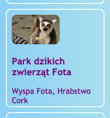
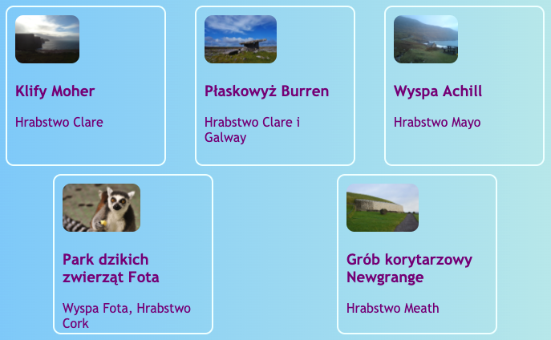
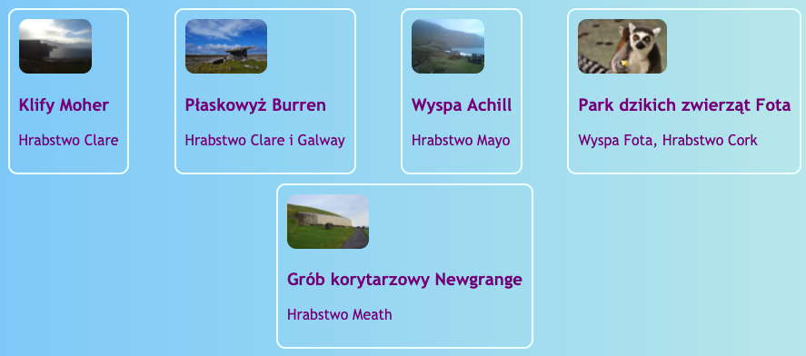
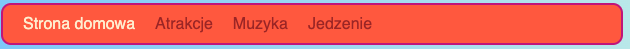
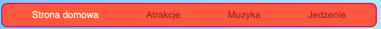
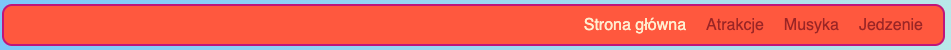

## Układ poziomy

Z tej karty nauczysz się kilku sposobów układania elementów na stronie **w poziomie**. Zaczniemy od wyśrodkowania elementów. Następnie ułożymy elementy w rzędzie obok siebie.

+ Dodaj następujące właściwości CSS do klasy `.card`:

```css
    margin-left: auto;
    margin-right: auto;
```

Karty powinny przesunąć się na środek strony. Ustawiając lewy i prawy margines na `auto` spowodujesz, że dowolny element znajdzie się na środku, zamiast po lewej.



+ Przeciągnij krawędź okna przeglądarki, aby zwęzić lub poszerzyć stronę — zauważ, że karty pozostają wyśrodkowane.

+ Umieść wszystkie linki do kart, które właśnie utworzyłeś, w nowym elemencie kontenera. Nie będzie to ani`artykuł`, ani `sekcja`, ale `div`. Jest to kontener ogólnego przeznaczenia, którego można używać do grupowania rzeczy i tworzenia ładnych układów.

```html
    <div class="cardContainer">
```

+ Dodaj następujący kod CSS do arkusza stylów:

```css
    .cardContainer {
        display: flex;
        flex-wrap: wrap;
        justify-content: space-around;
        padding: 10px;
    }
```

Otóż to! Dzięki **Flex**twoje karty są teraz wyświetlane obok siebie!

+ Przeciągnij krawędź okna, aby zwęzić lub poszerzyć stronę i spójrz jak karty się dopasowują do nowego rozmiaru oraz jak czasami zawijają się do następnej linii.



+ Spróbuj usunąć właściwości `szerokość` i `wysokość` z klasy `.card` i zobacz, co się stanie: `flex` sprytnie dopasuje karty do siebie jak układankę, utrzymując równą wysokość wszystkiego, co znajduje się w tym samym rzędzie.



Jeśli masz menu nawigacyjne na górze strony, to jest to kolejne miejsce, w którym możesz użyć tego triku. Twoje menu musi składać się z elementów listy( (`li`) dla następnego fragmentu. Jeśli wolisz, możesz wypróbować to na mojej stronie.

+ Znajdź reguły CSS dla menu. Na mojej stronie są bloki `nav ul`, `nav ul li` i `nav ul li a`.

+ Usuń właściwość `display: inline;` z elementów listy. Następnie na liście `nav ul`, dodaj:

```css
    display: flex;
    justify-content: flex-start;
```



Skończysz z tym samym menu, prawda? Fajną rzeczą związaną z `flex` jest to, że możesz kontrolować układ z właściwością `justify-content`.

+ Zmień wartość `justify-content` na `flex-end` i zobacz, co się stanie. Lub zmień go na `space-around` aby pozycje menu były równomiernie rozmieszczone, tak jak w przypadku kart.





**`Flex`** to dość potężne narzędzie do układania, które może wypełnić całą serię kart Sushi - możesz dowiedzieć się więcej na ten temat w [dojo.soy/html3-flex](http://dojo.soy/html3-flex).