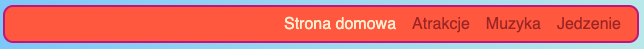

## Spraw, by Twoje menu było responsywne

**Responsywna** strona to taka, która dostosowuje się do rozmiaru ekranu tak, że zawsze wygląda świetnie. Nieważne czy patrzysz na nią na komputerze, telefonie komórkowym lub tablecie. Spraw, by Twoje menu było responsywne!

Zaczniesz od regularnych stylów: będzie to twoje **domyślne zachowanie**.

--- collapse ---
---
title: Co oznacza „domyślne”?
---

Domyślne style to normalny zestaw reguł stylu. Są stosowane bez względu na wszystko, przed sprawdzeniem specjalnych warunków.

Możesz dodać kod, który następnie sprawdza rozmiar ekranu i w razie potrzeby wprowadza pewne korekty.

--- /collapse ---

+ Add the following CSS rules to your menu. You probably have colours and borders defined as well; I've left them out to save space here! If you already have CSS rules defined for your menu, just add in or change the properties and values below that you are missing.

+ You will notice that the padding and margins have `em` values rather than the `px` values used previously. Pixels (px) are a static size but in a responsive website `em` is used to make adjustments for the size of the screen.

```css
    nav ul {
        padding: 0.5em;
        display: flex;
        flex-direction: column;
    }
    nav ul li {
        text-align: center; 
        list-style-type: none;
        margin-right: 0.5em;
        margin-left: 0.5em;
}
```

Z powyższym kodem CSS Twoje menu będzie najlepiej dostosowane do małych ekranów. To nazywa się rozwój typu **najpierw mobilne**.


--- collapse ---
---
title: Co oznacza "najpierw mobilne"?
---

Dość często podczas kodowania strony internetowej będziesz korzystać z ekranu komputera, a prawdopodobnie określisz swoje style na podstawie tego, jak wygląda na tym ekranie.

Kiedy piszesz stronę najpierw dla telefonu komórkowego, zamiast tego wybierasz domyślne style odpowiednie dla małych ekranów, takich jak smartfony. Następnie dodajesz dodatkowy kod, aby wprowadzić zmiany dla większych ekranów.

Ponieważ coraz więcej osób przegląda Internet na swoich smartfonach lub tabletach, a nie na komputerze, To dobra praktyka, aby rozwijać swoją witrynę mając to na uwadze.

--- /collapse ---

+ Teraz dodaj następujący kod do arkusza stylów:

```css
    @media all and (min-width: 1000px) {
        nav ul {
            flex-direction: row;
            justify-content: space-around;
        }
}
```

Pierwszy wiersz kodu powyżej sprawdza, jaki rozmiar ma okno przeglądarki. Jeśli okno jest **1000 pikseli** szerokie lub większe, to zastosuje wszystkie reguły stylu wewnątrz bloku.


--- collapse ---
---
title: Jak to działa?
---

Blok zawiera nowe wartości tylko dla niektórych właściwości menu `nav ul`.

Gdy okno jest szersze niż 1000 pikseli, te nowe wartości zostaną zastosowane zamiast tych, które już zdefiniowałeś dla `nav ul`.

Reszta właściwości zdefiniowanych wcześniej dla `nav ul` pozostanie taka sama.

--- /collapse ---

+ Jeśli używasz Trinket do pisania kodu, pomocne może być pobranie projektu, dzięki czemu możesz przetestować go na pełnym ekranie.

--- challenge ---

## Wyzwanie: dostosuj menu do dużych ekranów

+ Czy możesz dodać kolejny blok dla ekranów większych niż **1600 pikseli**, z `flex-end` zamiast `space-around`?



--- hints ---

--- hint ---

Poniższy kod definiuje właściwości flex dla pozycji menu, gdy ekran jest większy niż 1600 pikseli:

```css
    @media all and (min-width: 1600px) {
        nav ul {
            flex-direction: row;
            justify-content: flex-end;
        }
}  
```

--- /hint ---

--- /hints ---

--- /challenge ---

Możesz umieścić w takich blokach dowolne reguły CSS, aby zdefiniować różne style dla różnych rozmiarów ekranu. Będzie to szczególnie przydatne, gdy później zrobisz układy siatki CSS!