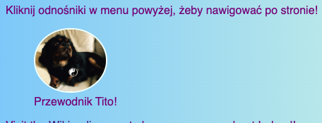
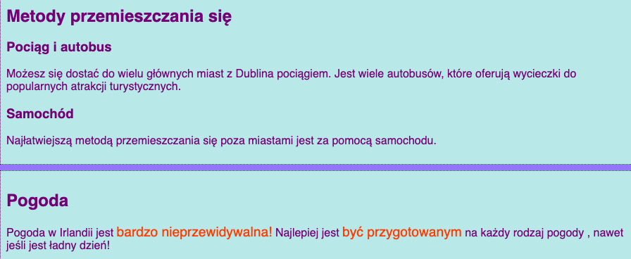

## Podpisy i dodatkowe notatki

Na tej karcie dowiesz się o dwóch dodatkowych rodzajach elementu **kontener**: takiego, którego możesz użyć do dodania podpisu (jakiś tekst jak tytuł lub krótki opis) do zdjęcia, i inne, gdy masz dodatkowe rzeczy, które nie należą do głównych informacji na stronie.

### Zdjęcia z podpisami

+ Znajdź element `img`, w którym masz tekst powyżej lub poniżej, który jest dołączony do zdjęcia. Pracuję z obrazem Tito w pliku `index.html`, ale możesz korzystać z wszystkiego, co znajduje się na Twojej stronie. 

```html
            
  <p>
    Przewodnik Tito!
  </p>
```

+ W linii powyżej kodu dodaj znacznik otwierający `<figure>`. W nowej linii pod kodem umieść znacznik zamykający `</figure>`.

+ Następnie usuń znaczniki `p` lub dowolne znaczniki, które masz wokół tekstu (może to nagłówek, na przykład `h2`?) i zamiast tego umieść tekst pomiędzy znaczniki `&lt;figcaption&gt;&lt;/figcaption&gt;</0>. Efekt powinien być taki jak poniżej:</p></li>
</ul>

<pre><code class="html">  <figure>
                
      <figcaption>
      Przewodnik Tito!
      </figcaption>
  </figure>
`</pre> 
    
    Element `figcaption` jest twoim **podpisem**. Może przejść albo powyżej elementu `img` albo poniżej niego.
    
    
    
    ##
--- collapse ---
    
    ## title: Dlaczego jest to przydatne?
    
    Element `figure` działa jako **kontener** dla zdjęcia i jego podpisu. Pozwala to na traktowanie ich jako jednej jednostki podczas definiowania stylów.
    
    Dzięki grupowaniu kodu możemy utrzymać dobrą strukturę kodu strony.
    
    --- /collapse ---
    
    Możesz użyć kodu CSS do stylu `figure` i `figcaption` jak każdy inny element używający klas, identyfikatorów lub selektorów elementów. Dodaję następujące reguły, aby usunąć dodatkowe odstępy dodane przez nowy kontener:
    
    ```css
      figure { 
          margin-top: 0px;
          margin-bottom: 0px;
          margin-left: 0px;
          margin-right: 0px;
      }
    ```
    
    ### Notatki dodatkowe
    
    Na mojej witrynie internetowej na podstronie Atrakcje umieściłem listę miejsc do odwiedzenia. Chcę dodać kilka notatek na temat pogody i sposobu przemieszczania się. Ta informacja tak naprawdę nie należy do elementu `article` ze wszystkimi atrakcjami. Jest to przykład, kiedy można użyć element `aside`.
    
    + Przejdź na stronę swojej witryny, która ma na sobie element `article` - używam `attractions.html`.
    
    + **Poza** elementem `article` dodaj jedną lub więcej par `<aside> </aside>` - znaczników zawierających dodatkowe rzeczy.
    
    ```html
      <aside class="sideNoteStyle">
          <h2>Poruszanie się</h2>
          <h3>Pociąg i autobus</h3>
          <p>Do większości dużych miast można dostać się pociągiem z Dublina. Istnieje wiele autobusów, które odbywają wycieczki do popularnych miejsc i atrakcji turystycznych.</p>
          <h3>Samochód</h3>
          <p>Najłatwiejszym sposobem poruszania się poza miastami jest samochód.</p>
        </aside>
        <aside class="sideNoteStyle">
          <h2>Pogoda</h2>
          <p>Pogoda w Irlandii jest <span class="specialText"> bardzo nieprzewidywalna!</span> Najlepiej <span class="specialText">być przygotowanym</span> na każdą pogodę, nawet jeśli jest to miły dzień!</p>
      </aside>
    ```
    
    ##
--- collapse ---
    
    ## title: Dlaczego jest to przydatne?
    
    Kontenery `aside`, `article`, i inne są podobne. Jedyną rzeczywistą różnicą jest **znaczenie**, czyli to, do czego ich używasz.
    
    Ważne jest, aby używać miarodajnych elementów HTML, kiedy tylko możesz. Daje to lepszą strukturę Twojej strony internetowej i jest szczególnie pomocne dla osób korzystających z **czytników ekranu**.
    
    --- /collapse ---
    
    Czy znalazłeś tam inny element, `span`? To jest specjalny znacznik, którego możesz użyć tylko do dodania dodatkowego kodu CSS! Możesz umieścić cokolwiek pomiędzy parą `span`. Jest przydatny dla takich rzeczy jak stylizacja **części** tekstu w ustępie.
    
    + Dodaj następujący kod CSS do arkusza stylów, aby uzupełnić styl kodu HTML powyżej.
    
    ```css
      .sideNoteStyle {
        border: dotted 1px purple;
        background-color: #c1ebec;
        padding: 0.5em;
        margin: 0.5em;
      }
      .specialText {
          color: #FF4500;
          font-size: larger;
      }
    ```
    
    
    
    Na następnej karcie nauczysz się, jak sprawić, by układ strony był bardziej interesujący!
    
    + Aby przygotować się, stwórz stronę, która ma jeden element `article` i dwa elementy `aside` wewnątrz znaczników `<main> </main>`. Lub jeśli wolisz, możesz pracować ze stroną Attractions na mojej stronie.