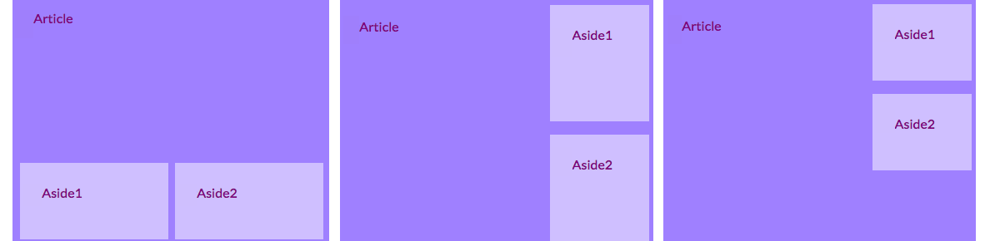

## Zaprojektuj fajne układy stron

+ W przypadku tej karty powinieneś pracować ze stroną, która zawiera element `main` z trzema elementami wewnątrz: jeden `article` i dwa `aside`. Kontynuuj i utwórz je najpierw, jeśli potrzebujesz. Jeśli chcesz pracować z moją stroną, dodaj kod `aside` z poprzedniej karty Sushi do strony Atrakcje. 

Oto trzy różne układy strony, które będziesz stosować:



+ Dodaj nowe klasy CSS do `main` i każdy z trzech elementów w nim zawartych.

```html
    <main class="attPageLayoutGrid">
        <article class="attGridArticle">
            <!--- inne rzeczy tutaj --->
        </article>
        <aside class="attGridAside1">
            <!--- inne rzeczy tutaj --->
        </aside>
        <aside class="attGridAside2">
            <!--- inne rzeczy tutaj --->
        </aside>
    </main>
```

Kontener, którego zmienisz układ, jest `main`, ale możesz to zrobić z dowolnym rodzajem kontenera, takim jak `div` lub `article` lub nawet całą stronę `body`. Technika, którą zamierzasz użyć, nazywa się **siatka CSS**.

W tym przykładzie `nagłówek` i `stopka` zostaną pominięte w projekcie, ale dość często włącza się je również do siatki.

+ Ustaw właściwość `display` na `grid` na całym kontenerze:

```css
    .attPageLayoutGrid {
        display: grid;
        grid-column-gap: 0.5em;
        grid-row-gap: 1em;
    }
```

Jak myślisz, co robią właściwości `grid-column-gap` i `grid-row-gap`?

+ Następnie nazwij `grid-area` dla każdego elementu: 

```css
    .attGridArticle {
        grid-area: agArticle;
    }
    .attGridAside1 {
        grid-area: agAside1;
    }
    .attGridAside2 {
        grid-area: agAside2;
    }
```

Następnie zaprojektujesz swój układ! Umieśćmy oba elementy `aside` obok siebie na dole strony. Do tego potrzebne są dwie **kolumny** o równej szerokości. Możesz zachować automatyczną wysokość **wiersza**.

+ Umieść następujący kod wewnątrz reguł CSS `.attPageLayoutGrid`:

```css
    grid-template-rows: auto;
    grid-template-columns: 1fr 1fr;
    grid-template-areas: 
        "agArticle agArticle"
        "agAside1 agAside2";
```

`fr` oznacza **ułamek**. Zauważ, że `article` zajmuje całą przestrzeń nad dwiema kolumnami.

--- collapse ---
---
title: Pomoc! Mam błędy i ostrzeżenia!
---

Jeśli używasz Trinket, możesz zauważyć pewne błędy i ostrzeżenia, nawet jeśli wpisałeś kod dokładnie tak jak powyżej. Dzieje się tak, ponieważ Trinket nie rozpoznaje jeszcze właściwości siatki CSS. Jednak kod nadal będzie działał.

Jeśli kod siatki CSS wyświetla ostrzeżenia „nieznana właściwość” lub błąd taki jak „nieoczekiwany token 1fr”, możesz po prostu je zignorować.

--- /collapse ---


Umieść elementy `aside` po prawej stronie i spraw, by były one o połowę mniejsze od `article`.

+ Zmień wartości `grid-template-columns` i `grid-template-areas` na:

```css
    grid-template-columns: 2fr 1fr;
    grid-template-areas: 
        "agArticle agAside1"
        "agArticle agAside2";
```


+ Jeśli nie chcesz, aby elementy `aside` rozciągały się do dołu, możesz dodać puste miejsce używając kropki: 

```css
    grid-template-areas: 
        "agArticle agAside1"
        "agArticle agAside2"
        "agArticle . ";
```


--- challenge ---

## Wyzwanie: stwórz różne układy dla różnych rozmiarów ekranu

+ Czy możesz użyć kontroli rozmiaru ekranu, którą dodałeś wcześniej, aby zmienić układ w zależności od szerokości ekranu? Uwaga: jeśli już utworzyłeś bloki CSS dla każdego rozmiaru ekranu, możesz dodać nowy kod CSS do tych bloków zamiast tworzyć nowe.

--- hints ---

--- hint ---

Poniższy kod definiuje układ dla klasy CSS powyżej, gdy ekran jest większy niż 1000 pikseli:

```css
    @media all and (min-width: 1000px) {
        .attPageLayoutGrid {
            grid-template-columns: 1fr 1fr;
            grid-template-areas: 
                "agArticle agArticle"
                "agAside1 agAside2";
        }
    }  
```

--- /hint ---

--- hint ---

Poniższy kod definiuje układ dla klasy CSS powyżej, gdy ekran jest większy niż 1600 pikseli:

```css
    @media all and (min-width: 1600px) {
        .attPageLayoutGrid {
            grid-template-columns: 1fr 1fr;
            grid-template-areas: 
                "agArticle agAside1"
                "agArticle agAside2"
                "agArticle .";
        }
    }  
```

--- /hint ---

--- /hints ---

--- /challenge ---

Z **siatką CSS** możesz wykonać prawie dowolny układ. Jeśli chcesz dowiedzieć się więcej, przejdź do [dojo.soy/html3-css-grid](http://dojo.soy/html3-css-grid){:target="_blank"}