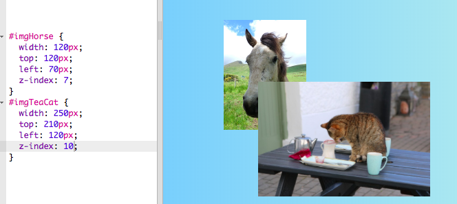
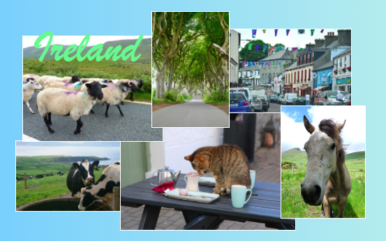

## Kolaż zdjęć

Na tej karcie nauczysz się używać CSS do dokładnego pozycjonowania elementów HTML i tworzenia kolażu fotograficznego.


+ Dodaj `div` do swojej strony i umieść w nim tyle obrazów, ile chcesz. Dodaj elementom `div` i `img` wartości `id`.

```html
    <div id="photoBox" class="relPos">
        
        
    </div>
```

Zdjęcia będą wyświetlane jeden po drugim na stronie internetowej, w kolejności, w jakiej pojawiają się w kodzie.

+ W swoim pliku CSS dodaj następującą klasę CSS dla elementów wewnątrz `div`: 

```css
    .absPos {
        position: absolute;
    }
```

+ Następnie musisz dodać właściwość `position: relative;` do kontenera i określić jego rozmiar. To sprawia, że pozycje innych elementów są zdefiniowane **względem** (to znaczy wewnątrz) kontenera.

```css
    .relPos {
        position: relative;
    }

    #photoBox {
        width: 800px;
        height: 400px;
    }
```

+ Następnie utwórz zestaw reguł stylu dla każdego elementu, używając **selektorów id** aby ustawić ich rozmiary (właściwości `width` i / lub `height`), jak również ich dokładne pozycje.

Aby zdefiniować pozycję elementu, można użyć czterech właściwości: `left`, `right`, `top` i `bottom`. Określają one, jak daleko każda krawędź powinna być od krawędzi rodzica. Użyj `top` lub `bottom` dla pozycjonowania w pionie i `left` lub `right` dla pozycjonowania w poziomie.


+ Wybierz dokładne pozycje dla każdego ze swoich zdjęć i użyj dowolnej właściwości `left`, `right`, `top`i `bottom` aby zdefiniować te pozycje w regułach CSS. Na przykład ten kod umieszcza obraz kota 100 pikseli od góry i 60 pikseli od lewej:

```css
    #imgTeaCat {
        width: 250px;
        top: 100px;
        left: 60px;
    }
```

Uwaga: Wartości pozycji mogą być również ujemne! Jeśli użyjesz wartości ujemnej, wypchnie ona element poza kontener, względem wybranej krawędzi.

### Sprawianie, że elementy nakładają się na siebie

Możesz chcieć, aby niektóre zdjęcia zachodziły na siebie. Ale jak wybrać, który z nich będzie na wierzchu?

+ Wybierz dwa obrazy i nadaj im pozycje, które powodują ich nakładanie się.

+ Dodaj dodatkową właściwość, `z-index: 10;` do jednego z nich, a następnie dodaj `z-index: 7;` do drugiego.

+ Spójrz na efekt na swojej stronie internetowej.


+ Teraz zamień wartości `z-index` , tak aby `7` i `10` były na odwrót. Czy widzisz jakąś różnicę na swojej stronie internetowej?



--- collapse ---
---
title: Jak działa z-index?
---

Właściwość `z-index` pozwala zdecydować, jak dwa lub więcej elementów powinny się nakładać. Wartość może być dowolną liczbą całkowitą.

Element z **największą liczbą** znajdzie się na **górze** stosu, czyli innymi słowy na **wierzchu**. Element z kolejnym najwyższym numerem znajduje się za tym i przed innymi, i tak dalej, aż dojdziesz do elementu o najniższym numerze, który pojawia się z tyłu za wszystkimi innymi elementami.

--- /collapse ---

Możesz pozycjonować dowolne elementy HTML w ten sposób, a nie tylko obrazy. Na przykład można użyć elementu `p` , aby dodać tekst do zdjęcia.

--- challenge ---

## Zadanie: zrób kolaż zdjęć

+ Spróbuj utworzyć własny kolaż zdjęć, jak pokazano poniżej! Użyj dokładnego pozycjonowania razem z różnymi wartościami `z-index`, aby uzyskać efekt nakładania się tak, jak chcesz.

--- hints ---

--- hint ---

Poniżej znajduje się kod HTML do kolażu zdjęć na mojej stronie internetowej w Irlandii. W `div` jest sześć zdjęć i fragment tekstu.

```html
    <div id="photoBox" class="relPos">
        
        
        
        
        
        
        <p id="photoText" class="absPos">Irlandia</p>
    </div>
```

--- /hint ---

--- hint ---

Oto reguły CSS, które ustawiają pozycje każdego z moich zdjęć w kolażu:

```css
    #imgHorse {
        width: 120px;
        top: 200px;
        left: 390px;
        z-index: 10;
    }
    #imgSheep {
        width: 200px;
        top: 100px;
        left: 20px;
        z-index: 8;
    }
    #imgCoast {
        width: 150px;
        top: 250px;
        left: 10px;
        z-index: 5;
    }
    #imgTrees {
        width: 110px;
        top: 65px;
        left: 205px;
        z-index: 9;
    }
    #imgTeaCat {
        width: 250px;
        top: 210px;
        left: 160px;
        z-index: 7;
    }
    #imgStreet {
        width: 180px;
        top: 90px;
        left: 310px;
        z-index: 6;
    }
    #photoText {
        font-family: "brush script MT";
        color: lightgreen;
        font-size: 4em;
        left: 35px;
        top: 15px;
        z-index: 20;
    }
```

--- /hint ---

--- hint ---

Oto klasy CSS, których użyłem:

```css
    .collagePhoto {
        border: 1px solid white;
    }
    .relPos {
        position: relative;
    }
    .absPos {
        position: absolute;
    }
```

--- /hint ---

--- /hints ---



--- /challenge ---