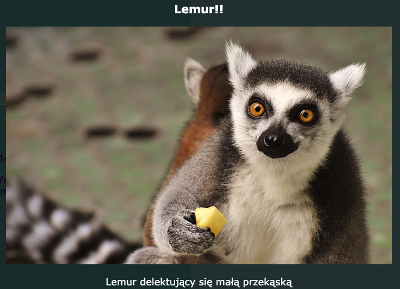

## Efekty specjalne

Na tej karcie nauczysz się kilku ciekawych efektów, które możesz osiągnąć za pomocą CSS.

### Cienie i ruch

Dodajmy trochę ruchu, gdy poruszasz kursorem nad kartami, które wcześniej wykonałeś.

+ Znajdź wcześniej utworzoną klasę CSS `.card:hover` i zmień ją następująco:

```css
    .card: hover {
        box-shadow: 0px 2px 2px rgba(0,0,0,0,2); 
        transform: translateY(-2px);
}
```

+ Wypróbuj różne wartości w funkcji `translate`!

## \--- collapse \---

## title: Właściwość `transform`

Jeśli ukończyłeś karty Sushi HTML/CSS dla średnio zaawansowanych, być może pamiętasz o użyciu właściwości `transform` w niektórych animacjach`@keyframes`. Tutaj zobaczysz, że możesz również użyć tej właściwości w zwykłym bloku CSS.

Jedną z wartości, którą możesz ustawić, jest `rotate`, aby obrócić element. Innymi właściwościami są `translateY`, które przesuwają coś w górę lub w dół, i `translateX`, aby poruszać się z boku na bok.

\--- /collapse \---

+ Eksperymentuj z różnymi wartościami w pikselach(px) we właściwości `box-shadow` aby zobaczyć, jak to wpływa na efekt. 

## \--- collapse \---

## title: Co to jest `rgba`?

`rgba(0,0,0,0.2)` to inny sposób definiowania koloru.

`rgba()` używa liczb (od `0` do <0>255</0>) dla koloru czerwonego, zielonego i niebieskiego.

Czwarta liczba, nazywana wartością **alfa**, która określa, jak **przeźroczyste** (lub prześwitujące) coś jest. Jest to liczba dziesiętna od `0` do `1`, przy czym `1` w ogóle nie jest przezroczysta, a `0` jest całkowicie niewidoczny. Oznacza to, że im niższa wartość alfa elementu, tym bardziej jest on przeźroczysty.

\--- /collapse \---

+ Na koniec spraw, aby ruch został wygładzony, dodając następującą właściwość do klasy `.card` z wcześniej: 

```css
    transition: all 0.2s ease-out;
```

Czas trwania `0.2 s` oznacza, że `przejścia` trwają 0.2 sekundy.

### Lightbox

Innym efektem, jaki prawdopodobnie widziałeś na wielu stronach internetowych, jest **lightbox**: klikasz na coś, a strona internetowa ściemnia się, gdy coś innego, jak większy obrazek lub wyskakujące okienko, pojawia się przed wszystkim.



Aby uzyskać ten efekt, musisz utworzyć dwa odnośniki: jeden dla rzeczywistego lightboxa (element, który wyskakuje), i jeden dla rzeczy, którą klikniesz, aby wyświetlić lightbox. Zamierzam zrobić takie coś na podstronie Atrakcje mojej witryny internetowej. Ty możesz to zrobić na jakiejkolwiek stronie, na której masz zdjęcia!

+ Zdecyduj, jakie rzeczy chcesz wyświetlać po kliknięciu i dodaj je wszystkie do swojej strony pomiędzy znacznikami `a`, aby utworzyć odnośnik. Upewnij się, że masz `id` dodane do odnośnika. Kod możesz umieścić gdziekolwiek na stronie: w następnym kroku uczynisz elementy niewidocznymi!

```html
    <a href="#_" class="lightbox" id="boxLemur">
        <h3>Lemur!!</h3>
        
        <p>Lemur cieszący się małą przekąską</p>
    </a>
```

Możesz umieścić wszystko, co ci się podoba, pomiędzy znacznikami linku. Mam nagłówek, duży obraz oraz jakiś tekst. Może ty po prostu chcesz mieć obraz bez żadnego tekstu?

+ Dodaj następujący kod CSS dla lightbox. Czy potrafisz zrozumieć, co to robi?

```css
    .lightbox{
        background: rgba(0,0,0,0.8);
        color: #ffffff;
        text-align: center;
        text-decoration: none;
        width: 100%;
        height: 100%;
        top: 0;
        left: 0;
        position: fixed;
        visibility: hidden;
        z-index: 999;
    }
```

Uwaga: Ustawienie właściwości `position` na `fixed` oznacza, że pozycja będzie ustawiona względem okna przeglądarki, więc pozostanie ona nieruchoma podczas przewijania.

+ Następnie zdecyduj, co chcesz kliknąć, aby pojawił się lightbox, i dodaj parę znaczników `a` wokół tego elementu (w moim przypadku jest to mniejszy obraz lemura). **Obiektem docelowym** linku będzie lightbox, który ustawisz za pomocą jego `id`. Być może rozpoznajesz tę technikę z wcześniejszych materiałów!

```html
    <a href="#boxLemur">
        
    </a>
```

+ Na koniec dodaj następujący kod CSS. Należy zauważyć, że jest to **pseudoklasa** i powinna znajdować się za kodem klasy `.lightbox` a nie wewnątrz!

```css
    .lightbox:target {
        visibility: visible;
    }
```

Pseudoklasa `:target` zostanie zastosowana za każdym razem, gdy lightbox był celem ostatniego klikniętego łącza. Więc po kliknięciu w dowolnym innym miejscu, `visibility` zostanie ustawione z powrotem na `hidden`.

+ Spróbuj kliknąć twój nowy odnośnik, aby zobaczyć lightbox! Aby on zniknął, wystarczy kliknąć gdziekolwiek na stronie.

Możesz dodać dowolną liczbę lightboxów do strony. Wszystkie mogą używać tej samej klasy CSS - wystarczy upewnić się, że każdy z nich ma inne `id`! Dla każdego z nich musisz utworzyć coś na swojej stronie internetowej działające jako odnośnik, który możesz kliknąć, aby pojawił się lightbox, a następnie użyć `id` jako wartości `href` w tym odnośniku, tak jak powyżej!