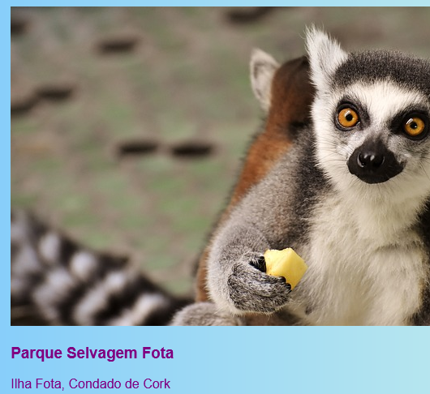
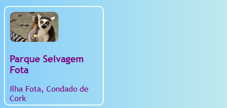
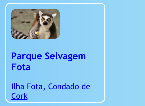

## Cartões clicáveis

Aqui está uma técnica que você pode usar para criar uma galeria de fotos ou uma página de portfólio mostrando seus projetos: pequenos **cartões de visualização**.


+ Adicione o seguinte código HTML ao seu site, onde quiser. Estou fazendo o meu no `index.html`. Você pode alterar a imagem e o texto para se adequar aos seus próprios cartões de visualização. Eu vou fazer um monte de destaques das atrações turísticas na Irlanda.

```html
    <article class="card">
        
        <h3>Parque Selvagem Fota</h3>
        <p>Ilha Fota, Condado de Cork</p>
    </article>
```



+ Adicione o seguinte código CSS para criar as classes `card` e `tinyPicture`:

```css
    .tinyPicture {
        height: 60px;
        border-radius: 10px;
    }
    .card {
        width: 200px;
        height: 200px;
        border: 2px solid #F0FFFF;
        border-radius: 10px;
        box-sizing: border-box;
        padding: 10px;
        margin-top: 10px;
        font-family: "Trebuchet MS", sans-serif;
    }
    .card:hover {
        border-color: #1E90FF;
    }
```



Vamos transformar o cartão de visualização em um link para que as pessoas possam clicar para ver mais informações.

+ Coloque todo o elemento `article` dentro de um elemento de link. Certifique-se de que a tag de fechamento `</a>` esteja depois da tag de fechamento `</article>`! Sinta-se à vontade para alterar o link **URL** para o que quiser vincular. Pode ser outra página do seu site ou outro site.

```html
    <a href="attractions.html#scFota">  
        <article class="card ">
            
            <h3>Parque Selvagem Fota</h3>
            <p>Ilha Fota, Condado de Cork</p>
        </article>
    </a>
```



--- collapse ---
---
title: Vinculando a uma parte específica de uma página
---

Nota como o valor de `href` no meu link termina em `#scFota`? Este é um truque legal que você pode usar para saltar para uma parte específica de uma página.

+ Primeiro, digite o URL da página para vincular, seguido por `#`.

+ No arquivo de código para a página para a qual você está vinculando, encontre a parte para onde deseja ir e dê ao elemento um `id`, por exemplo, `<section id="scFota"`. O valor do `id` é o que você digita após o `#` no seu link.

--- /collapse ---

--- collapse ---
---
title: Redefinindo estilos
---

Agora que todo o cartão de visualização é um link, a fonte do texto pode ter sido alterada.

+ Nesse caso, você pode corrigi-lo adicionando uma **classe CSS** ao link: `class="cardLink"`. Aqui está o código CSS para colocar na sua folha de estilos:

```css
    .cardLink {
        color: inherit;
        text-decoration: none;
    }
```

Configurando o valor de qualquer propriedade para `inherit` faz usar o valor que o elemento **pai** tem. Portanto, neste caso, a cor do texto coincidirá com o resto do texto na página inicial.

--- /collapse ---

+ Faça pelo menos quatro ou cinco desses cartões. Se você estiver trabalhando no meu site de exemplo, você pode fazer um para cada uma das seções na página Atrações. No passo seguinte, você aprenderá a organizar os cartões com um truque legal!