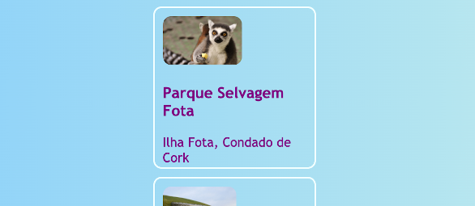
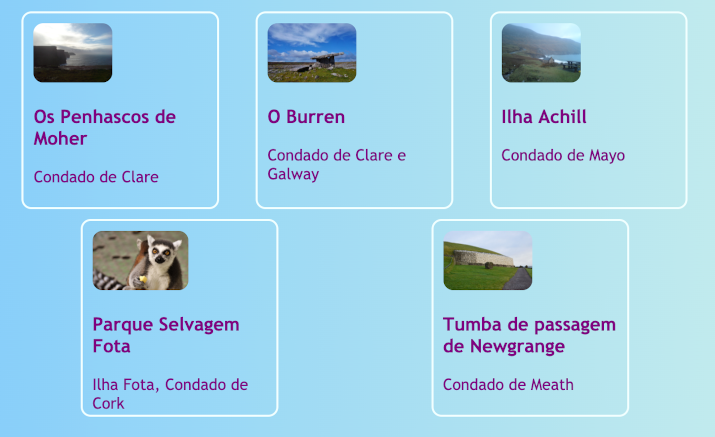
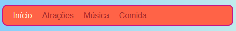
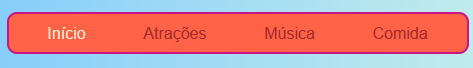
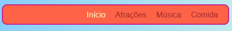

## Tudo em uma linha

Neste passo, você aprenderá alguns truques para organizar as coisas **horizontalmente** em uma página. Primeiro, você verá como centralizar as coisas. Então você organizará os elementos lado a lado em uma linha.

+ Adicione as seguintes propriedades CSS a classe `.card`:

```css
    margin-left: auto;
    margin-right: auto;
```

Você deve ver os cartões se movendo para o centro da página. Ao definir as margens esquerda e direita com `auto`, você pode fazer com que qualquer elemento fique no meio, em vez de ficar à esquerda.



+ Arraste a borda da janela do navegador para tornar a página mais estreita e mais ampla — observe que os cartões permanecem centralizados.

+ Coloque todos os links de cartões que você acabou de criar em um novo elemento contêiner. Não será um `article` ou uma `section`, mas sim um chamado `div`. Este é um contêiner de propósito geral que você pode usar para agrupar coisas e fazer layouts agradáveis.

```html
    <div class="cardContainer">
```

+ Adicione o seguinte código CSS na sua folha de estilo:

```css
    .cardContainer {
        display: flex;
        flex-wrap: wrap;
        justify-content: space-around;
        padding: 10px;
    }
```

Voilà! Graças ao **Flex**, seus cartões agora são exibidos lado a lado!

+ Arraste a borda da sua janela para tornar o site mais amplo e mais estreito, e veja como os cartões se movem para caber no tamanho da janela, às vezes passando para a próxima linha.



+ Tente excluir as propriedades `width` e `height` das propriedades `.card` e veja o que acontece: `flex` inteligentemente se encaixa nos cartões como um quebra-cabeça, mantendo uma altura ao longo de tudo que está na mesma linha.


Se você tiver um menu de navegação no topo da sua página, esse é outro lugar que você pode usar esse truque. Seu menu precisa ser composto por elementos de lista (`li`) para este próximo ponto. Se preferir, você pode experimentar com o meu site.

+ Encontre as regras CSS para o menu. No meu site, esses são os blocos `nav ul`, `nav ul li` e `nav ul li a`.

+ Exclua a propriedade `display: inline;` dos itens da lista. Então, na lista `nav ul`, adicione:

```css
    display: flex;
    justify-content: flex-start;
```



Você acaba com quase o mesmo menu, certo? Uma coisa legal sobre o `flex` é que você pode controlar o layout com a propriedade `justify-content`.

+ Altere o valor de `justify-content` para `flex-end` e veja o que acontece. Ou mude para `space-around` para deixar os itens do menu igualmente espaçados, como fez para os cartões.





**`flex`** é uma ferramenta de layout muito poderosa que poderia preencher uma série de passos nesse projeto — você pode aprender mais sobre isso em [dojo.soy/html3-flex](http://dojo.soy/html3-flex).