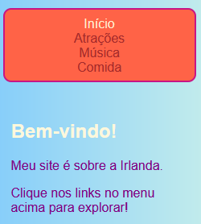
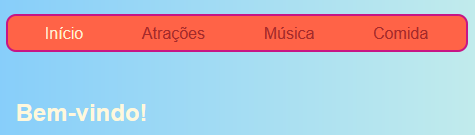
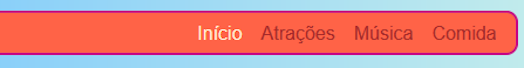

## Torne seu menu responsivo

Um site **responsivo** é um site que se ajusta ao tamanho da tela, para que sempre pareça ótimo, acessando-o em um computador, celular ou tablet. Vamos fazer o seu menu responsivo!

Você começará com os estilos normais: este será o seu comportamento **padrão**.

## \--- collapse \---

## title: O que significa 'padrão'?

Os estilos padrão são seu conjunto normal de regras de estilo. São aplicadas seja o que for, antes de verificar quaisquer condições especiais.

Você pode adicionar um código que verifica o tamanho da tela e faz alguns ajustes se necessário.

\--- /collapse \---

+ Adicione as seguintes regras CSS ao seu menu. Você provavelmente também tem cores e bordas definidas; Eu os deixei de fora para economizar espaço aqui! Se você já tem regras CSS definidas para o seu menu, basta adicionar ou alterar as propriedades e valores abaixo que estão faltando.

```css
    nav ul {
        padding: 0.5em;
        display: flex;
        flex-direction: column;
    }
    nav ul li {
        text-align: center; 
        list-style-type: none;
        margin-right: 0.5em;
        margin-left: 0.5em;
    }
```

Com o código CSS acima, seu menu será mais adequado para telas pequenas. Isso é chamado desenvolvimento **mobile-first**.



## \--- collapse \---

## title: O que significa 'mobile-first'?

Muitas vezes, ao codificar um site, você estará usando uma tela de computador, e você provavelmente definirá seus estilos com base em como ele fica nessa tela.

Ao codificar para mobile-first, você escolhe estilos adequados para telas pequenas, como smartphones. Então adicione um código extra para fazer ajustes para telas maiores.

Como mais e mais pessoas navegam na internet em seus smartphones ou tablets do que em um computador, É uma boa prática desenvolver seu site com isso em mente.

\--- /collapse \---

+ Agora adicione o seguinte código à sua folha de estilos:

```css
    @media all and (min-width: 1000px) {
        nav ul {
            flex-direction: row;
            justify-content: space-around;
        }
    }
```

A primeira linha de código acima verifica o tamanho da janela do navegador. Se a janela tiver **1000 pixels** ou mais, ela aplicará todas as regras de estilo dentro do bloco.



## \--- collapse \---

## title: Como isso funciona?

O bloco contém novos valores para apenas algumas propriedades do menu `nav ul`.

Sempre que a janela for maior que 1000 pixels, estes valores serão aplicados em vez dos que você já tinha definido para `nav ul`.

O resto das propriedades que você definiu anteriormente para `nav ul` permanecerá o mesmo.

\--- /collapse \---

+ Se você estiver usando o Trinket para escrever código, pode ser útil baixar o projeto, para que você possa testá-lo em uma tela de tamanho inteiro.

\--- challenge \---

## Desafio: faça seu menu se ajustar para telas grandes

+ Você pode adicionar outro bloco de telas maiores que **1600 pixels**, com `flex-end` em vez de `space-around`?



\--- hints \---

\--- hint \---

O código a seguir define propriedades flex para itens de menu quando a tela for maior do que 1600 pixels:

```css
    @media all and (min-width: 1600px) {
        nav ul {
            flex-direction: row;
            justify-content: flex-end;
        }
    }  
```

\--- /hint \---

\--- /hints \---

\--- /challenge \---

Você pode colocar quaisquer regras CSS que você gosta em blocos como estes para definir diferentes estilos para diferentes tamanhos de tela. Depois será especialmente útil quando você fizer layouts de grade com CSS!