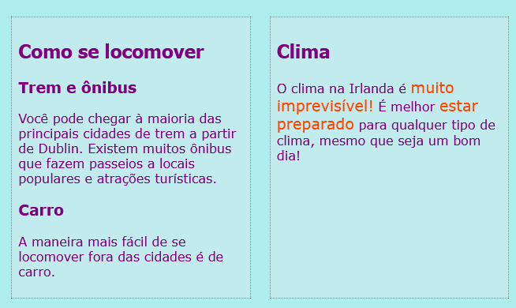
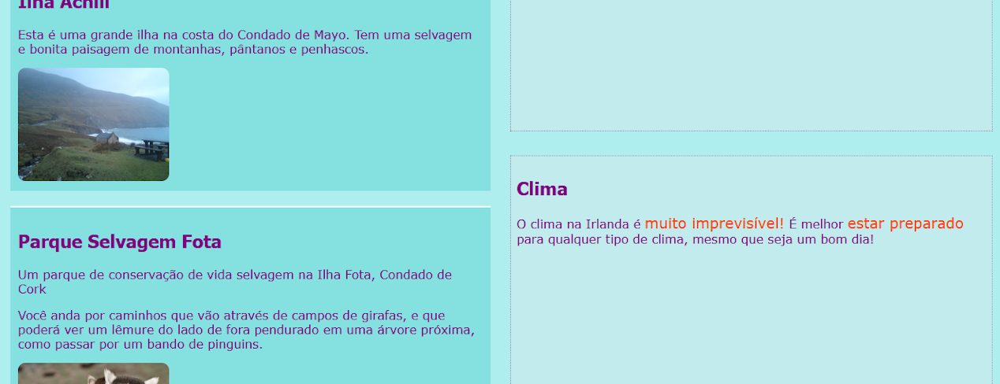
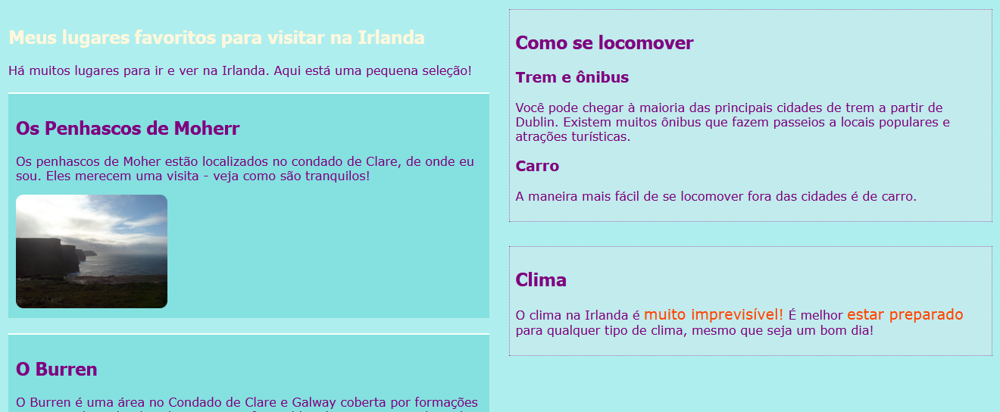

## Projete layouts legais de páginas

+ Para este passo, você deve trabalhar com uma página que contém um elemento `main` com três elementos dentro: um `article` e dois `aside`s. Vá em frente e crie-os primeiro, se você precisar. Se você deseja trabalhar com o meu site, adicione o código `aside` do passo anterior à página Atrações. 

Aqui estão três layouts de página diferentes que você aplicará:


+ Adicione novas classes CSS ao `main` e cada um dos três elementos dentro dele.

```html
    <main class="attPageLayoutGrid">
        <article class="attGridArticle">
            <!--outras coisas aqui-->
        </article>
        <aside class="attGridAside1">
            <!--outras coisas aqui-->
        </aside>
        <aside class="attGridAside2">
            <!--outras coisas aqui-->
        </aside>
    </main>
```

O contêiner que você irá alterar o layout é o `main`, mas você pode fazer isso com qualquer tipo de contêiner, como `div` ou `article`, ou mesmo a página inteira `body`. A técnica que você vai usar se chama **CSS grid**.

Neste exemplo, o `header` e o `footer` ficarão fora do design, mas é bastante comum incluí-los na grade também.

+ Defina a propriedade `display` como `grid` no contêiner geral:

```css
    .attPageLayoutGrid {
        display: grid;
        grid-column-gap: 0.5em;
        grid-row-gap: 1em;
    }
```

O que você acha que as propriedades `grid-column-gap` e `grid-row-gap` fazem?

+ Em seguida, nomeie uma `grid-area` para cada elemento: 

```css
    .attGridArticle {
        grid-area: agArticle;
    }
    .attGridAside1 {
        grid-area: agAside1;
    }
    .attGridAside2 {
        grid-area: agAside2;
    }
```

Então você projeta seu layout! Vamos colocar os dois elementos `aside` lado a lado na parte inferior da página. Para isto você precisa de duas **colunas** de largura igual. Você pode manter a altura da **linha** automática.

+ Coloque o seguinte código dentro das regras CSS `.attPageLayoutGrid`:

```css
    grid-template-rows: auto;
    grid-template-columns: 1fr 1fr;
    grid-template-areas: 
        "agArticle agArticle"
        "agAside1 agAside2";
```

`fr` significa **fração**. Observe como você faz o `article` ocupar todo o espaço sobre as duas colunas.

## \--- collapse \---

## title: Ajuda! Eu tenho erros e avisos!

Se você estiver usando o Trinket, poderá observar alguns erros e avisos, mesmo se você digitou o código exatamente como acima. Isso ocorre porque o Trinket ainda não reconhece as propriedades grid do CSS. No entanto, o código ainda funcionará.

Se o código da grade CSS fornece advertências de 'propriedade desconhecida' ou um erro como 'token inesperado 1 fr', você pode simplesmente ignorá-los.

\--- /collapse \---



Vamos colocar os elementos `aside` à direita e fazê-los metade da largura do `article`.

+ Altere os valores de `grid-template-columns` e `grid-template-areas` para:

```css
    grid-template-columns: 2fr 1fr;
    grid-template-areas: 
        "agArticle agAside1"
        "agArticle agAside2";
```



+ Se você não quer o elemento `aside` se estique todo até a parte inferior, você pode adicionar um espaço em branco usando um ponto: 

```css
    grid-template-areas: 
        "agArticle agAside1"
        "agArticle agAside2"
        "agArticle . ";
```



\--- challenge \---

## Desafio: faça layouts diferentes para tamanhos de tela diferentes

+ Você pode usar as verificações de tamanho de tela que você adicionou anteriormente para fazer o layout mudar dependendo da largura da tela? Nota: se você já criou blocos CSS para cada tamanho de tela, você pode adicionar o novo código CSS a esses blocos em vez de criar novos.

\--- hints \---

\--- hint \---

O código a seguir define um layout para a classe CSS acima quando a tela for maior que 1000 pixels:

```css
    @media all and (min-width: 1000px) {
        .attPageLayoutGrid {
            grid-template-columns: 1fr 1fr;
            grid-template-areas: 
                "agArticle agArticle"
                "agAside1 agAside2";
        }
    }  
```

\--- /hint \---

\--- hint \---

O código a seguir define um layout para a classe CSS acima quando a tela for maior do que 1600 pixels:

```css
    @media all and (min-width: 1600px) {
        .attPageLayoutGrid {
            grid-template-columns: 1fr 1fr;
            grid-template-areas: 
                "agArticle agAside1"
                "agArticle agAside2"
                "agArticle .";
        }
    }  
```

\--- /hint \---

\--- /hints \---

\--- /challenge \---

Com a **grade CSS**, você pode criar praticamente qualquer layout que desejar. Se você quiser aprender mais, acesse [dojo.soy/html3-css-grid](http://dojo.soy/html3-css-grid){:target="_blank"}