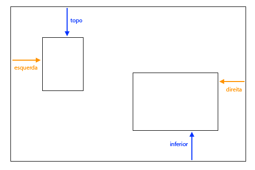

## Colagem de fotos

Neste passo, você aprenderá a usar o CSS para posicionar exatamente elementos HTML e criar uma colagem de fotos.


+ Adicione uma `div` à sua página e coloque quantas imagens quiser. Dê a `div` e aos elementos `img` valores `id`.

```html
    <div id="photoBox" class="relPos">
        
        
    </div>
```

As fotos aparecerão uma após a outra na página, na ordem em que aparecem no seu código.

+ No seu arquivo CSS, adicione a seguinte classe CSS para os elementos dentro da `div`: 

```css
    .absPos {
        position: absolute;
    }
```

+ Em seguida, você precisa adicionar a propriedade `position: relative;` ao próprio contêiner e definir um tamanho para ele. Isto faz com que as posições dos outros elementos sejam definidas **relativas a** (ou seja, dentro) do contêiner.

```css
    .relPos {
        position: relative;
    }

    #photoBox {
        width: 800px;
        height: 400px;
    }
```

+ Em seguida, crie um conjunto de regras de estilo para cada um dos elementos usando os ** seletores id** para definir seus tamanhos (propriedades `width` e/ou `height`), bem como suas posições exatas.

Para definir a posição de um elemento, existem quatro propriedades que você pode usar: `left`, `right`, `top` e `bottom`. Elas representam o quão longe cada uma das bordas deve estar da borda do pai. Use `top` ou `bottom` para a posição vertical, e `left` ou `right` para a posição horizontal.



+ Escolha posições exatas para cada uma de suas imagens, e use qualquer uma das propriedades `left`, `right`, `top` e `bottom` para definir essas posições em suas regras CSS. Por exemplo, este código coloca a imagem do gato 100 pixels do topo e 60 pixels da esquerda:

```css
    #imgTeaCat {
        width: 250px;
        top: 100px;
        left: 60px;
    }
```

Nota: Os valores da posição também podem ser negativos! Se você usar um valor negativo, ele irá empurrar o elemento para fora do contêiner, sobre qualquer borda que você tenha especificado.

### Fazendo as coisas se sobreporem

Você pode querer que algumas das fotos se sobreponham. Mas como você escolhe qual deles vai por cima?

+ Escolha duas imagens e dê a elas posições que fazem com que elas se sobreponham.

+ Adicione uma propriedade extra, `z-index: 10;` a um deles e adicione `z-index: 7;` para o outro.

+ Dê uma olhada no resultado na sua página.


+ Agora troque os valores de `z-index`, para que `7` e `10` sejam o contrário. Você vê alguma diferença na sua página?


--- collapse ---
---
title: Como funciona o z-index?
---

A propriedade `z-index` permite decidir como dois ou mais elementos devem se sobrepor. O valor pode ser qualquer número inteiro.

O elemento com o número **maior** acaba em **cima** do pilha ou, em outras palavras, na **frente**. O elemento com o próximo maior número está por trás disso, e na frente dos outros, e assim por diante, até você chegar ao elemento com o número mais baixo, que aparece na parte de trás de todos os outros elementos.

--- /collapse ---

Você pode posicionar qualquer elemento HTML dessa maneira, não apenas imagens. Por exemplo, você pode usar um elemento `p` para adicionar algum texto sobre uma foto.

--- challenge ---

## Desafio: faça uma colagem de fotos

+ Tente criar sua própria colagem de fotos como a mostrada abaixo! Use o posicionamento exato juntamente com diferentes valores de `z-index` para obter o efeito de sobreposição da maneira que você quiser.

--- hints ---


--- hint ---

Abaixo está o código HTML para a colagem de fotos no meu site da Irlanda. Existem seis fotos e um pouco de texto dentro de uma `div`.

```html
    <div id="photoBox" class="relPos">
        
        
        
        
        
        
        <p id="photoText" class="absPos">Irlanda</p>
    </div>
```

--- /hint ---

--- hint ---

Aqui estão as regras de CSS que definem as posições de cada uma das minhas imagens na colagem:

```css
    #imgHorse {
        width: 120px;
        top: 200px;
        left: 390px;
        z-index: 10;
    }
    #imgSheep {
        width: 200px;
        top: 100px;
        left: 20px;
        z-index: 8;
    }
    #imgCoast {
        width: 150px;
        top: 250px;
        left: 10px;
        z-index: 5;
    }
    #imgTrees {
        width: 110px;
        top: 65px;
        left: 205px;
        z-index: 9;
    }
    #imgTeaCat {
        width: 250px;
        top: 210px;
        left: 160px;
        z-index: 7;
    }
    #imgStreet {
        width: 180px;
        top: 90px;
        left: 310px;
        z-index: 6;
    }
    #photoText {
        font-family: "brush script MT";
        color: lightgreen;
        font-size: 4em;
        left: 35px;
        top: 15px;
        z-index: 20;
    }
```

--- /hint ---

--- hint ---

Aqui estão as classes CSS que eu usei:

```css
    .collagePhoto {
        border: 1px solid white;
    }
    .relPos {
        position: relative;
    }
    .absPos {
        position: absolute;
    }
```

--- /hint ---

--- /hints ---


--- /challenge ---