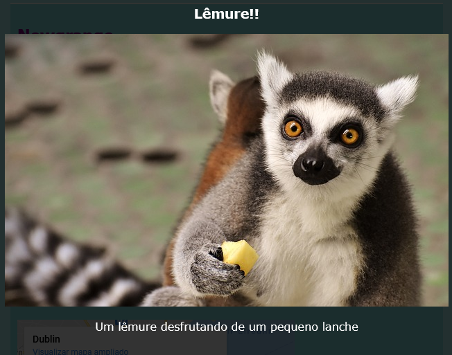

## Efeitos especiais

Neste passo, você aprenderá mais alguns efeitos interessantes que você pode obter com CSS.

### Sombras e movimento

Vamos adicionar um pouco de movimento quando você passa o cursor sobre os cartões feitos anteriormente.

+ Encontre a classe CSS `.card: hover` de antes e altere-a para o seguinte:

```css
    .card:hover {
        box-shadow: 0px 2px 2px rgba(0,0,0,0.2); 
        transform: translateY(-2px);
    }
```

+ Tente valores diferentes na função `translate`!

--- collapse ---
---
title: A propriedade `transform`
---

Se você completou os cartões intermediários Sushi HTML/CSS, você pode se lembrar de usar a propriedade `transform` em algumas animações `@keyframes`. Aqui você vê que você também pode usar a propriedade por conta própria dentro de um bloco CSS normal.

Um tipo de valor para o qual você pode definir é `rotate`, para fazer um elemento girar. Outros são `translateY`, o que move algo para cima ou para baixo, e `translateX`, para movimento de um lado para o outro.

--- /collapse ---

+ Brinque com diferentes valores em pixel na propriedade `box-shadow` para ver o que eles fazem. 

--- collapse ---
---
title: O que é `rgba`?
---

`rgba (0,0,0,0,2)` é outra maneira de definir uma cor.

Tem os três números habituais (de `0` até `255`) para vermelho, verde e azul.

O quarto número, chamado de valor **alfa**, define quão **transparente** algo é. É um número decimal entre `0` e `1`, `1` não sendo absolutamente transparente, e `0` sendo completamente invisível. Isto significa quanto menor for o valor alfa de um elemento, mais transparente ele é.

--- /collapse ---

+ Finalmente, torne o movimento suave adicionando a seguinte propriedade à classe `.card` de antes: 

```css
    transition: all 0.2s ease-out;
```

Uma duração de `0.2s` significa que a `transição` dura 0,2 segundos.

### Lightbox

Outro efeito que você provavelmente viu em muitos sites é **lightbox**: você clica em algo e o site escurece enquanto outras coisas, como uma imagem maior ou uma caixa de popup, aparece na frente de tudo.



Para obter este efeito, você criará dois links: um para a lightbox real (a parte que aparece), e um para aquilo que você clica para fazer a lightbox aparecer. Eu vou fazer o meu na página Atrações do meu site. Você vai com qualquer página que tiver fotos!

+ Decida quais itens você deseja fazer aparecer quando você clicar, e adicione-os todos à sua página entre um conjunto da tag `a` para criar um link. Certifique-se de dar ao link um `id`. O código pode ir para qualquer lugar da página: você estará tornando os elementos invisíveis na próxima etapa!

```html
    <a href="#_" class="lightbox" id="boxLemur">
        <h3> Lêmure!!</h3>
        
        <p>Um lêmure desfrutando de um pequeno lanche</p>
    </a>
```

Você pode colocar o que quiser entre as tags do link. Eu tenho uma imagem grande, um cabeçalho e um pouco de texto. Talvez você queira apenas uma imagem e nenhum texto!

+ Adicione o seguinte código CSS para a lightbox. Você pode descobrir o que algumas delas fazem?

```css
    .lightbox{
        background: rgba(0,0,0,0.8);
        color: #ffffff;
        text-align: center;
        text-decoration: none;
        width: 100%;
        height: 100%;
        top: 0;
        left: 0;
        position: fixed;
        visibility: hidden;
        z-index: 999;
    }
```

Nota: Definir a propriedade `position` para `fixed` significa que a posição que você definiu será relativa à janela do navegador, portanto permanecerá na posição quando você rolar.

+ Em seguida, decida o objeto que você quer clicar para fazer a lightbox aparecer, e adicione um par de tags `a` ao redor desse elemento (no meu caso é uma imagem menor de um lêmure). O **alvo** do link será a lightbox, que você definiu usando o `id`. Você pode reconhecer essa técnica anteriormente!

```html
    <a href="#boxLemur">
        
    </a>
```

+ Por fim, adicione o seguinte código CSS. Note que esta é uma **pseudo-classe**; deve ir depois do código para classe `.lightbox` e não dentro dela!

```css
    .lightbox:target {
        visibility: visible;
    }
```

A pseudo-classe `:target` é aplicada sempre que a lightbox for o alvo do último link clicado. Então, quando você clicar em qualquer lugar, a `visibility` será alterada para `hidden`.

+ Tente clicar no seu novo link para ver a lightbox aparecer! Para fazê-la sair, basta clicar em qualquer lugar na página.

Você pode adicionar quantas lightbox quiser a uma página. Elas podem usar a mesma classe CSS — apenas certifique-se de que cada uma tenha um `id`! Para cada uma, você precisa fazer algo em sua página em um link que você pode clicar para fazer a lightbox aparecer, e, em seguida, use o `id` como o valor `href` desse link, como você fez acima!


***
Este projeto foi traduzido por voluntários:

Lucas Pereira Santos

Douglas Reis

Graças a voluntários, podemos dar às pessoas de todo o mundo a chance de aprender em seu próprio idioma. Você pode nos ajudar a alcançar mais pessoas oferecendo-se para traduzir - mais informações em rpf.io/translate.