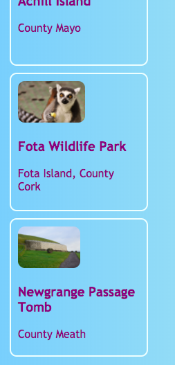

## Carduri care pot fi incarcate

Iată o tehnică pe care ar putea folosi pentru a face o galerie foto, sau o pagină de portofoliu care arată off proiectele tale: mici **carduri de previzualizare**.



+ Adăugați următorul cod HTML pe site-ul dvs. Web, oriunde doriți. Fac pe a mea `index.html`. Puteți schimba imaginea și textul pentru a se potrivi propriilor carduri de previzualizare. Voi face o grămadă de atracții turistice din Irlanda.

```html
    <article class="card">
        
        <h3>Fota Wildlife Park</h3>
        <p>Fota Island, Cork</p>
    </article>
```


+ Adăugați următorul cod CSS pentru a crea clasele `card` și `tinyPicture`:

```css
    .tinyPicture {height: 60px; raza de graniță: 10 pixeli; } .card {lățime: 200px; înălțime: 200px; frontieră: 2px solid # F0FFFF; raza de graniță: 10 pixeli; box-size: caseta de margine; padding: 10px; margin-top: 10px; font-familie: "Trebuchet MS", sans-serif; } .card: hover {border-color: # 1E90FF; }
```


Să transformăm întreaga carte de previzualizare într-un link, astfel încât oamenii să poată da clic pentru a vedea mai multe informații.

+ Se pune tot `articolul` în interiorul unui element de legătură. Asigurați-vă că eticheta de închidere `</a>` este după eticheta de închidere `</article>`! Simțiți-vă liber să schimbați linkul **URL** la orice doriți să vă conectați. Aceasta ar putea fi o altă pagină de pe site-ul dvs. sau ar putea fi altul în întregime.

```html
    <a href="attractions.html#scFota">  
        <article class="card ">
            
            <h3>Fota Wildlife Park</h3>
            <p>Fota Island, Județul Cork</p>
        </article>
    </a>
```


## \--- colaps \---

## title: Legarea la o anumită parte a unei pagini

Observați cum valoarea `href` din linkul meu se termină în `#scFota`? Acesta este un truc elegant pe care îl puteți utiliza pentru a sări la o anumită parte a paginii.

+ Mai întâi, tastați adresa URL a paginii de conectat, urmată de `#`.

+ În fișierul de cod pentru pagina cu care vă conectați, găsiți partea în care doriți să faceți salt și dați elementul respectiv `id`, de exemplu `<secțiunea id = "scFota"`. Valoarea lui `id` este cea pe care o introduceți după `#` în link-ul dvs.

\--- / colaps \---

## \--- colaps \---

## title: Resetarea stilurilor

Acum că întreaga carte de previzualizare este un link, fontul textului s-ar putea să fi schimbat.

+ Dacă da, puteți remedia problema prin adaugarea unei **clasa CSS** la link - ul: `class = "cardLink"`. Iată codul CSS pentru a pune în foaia dvs. de stil:

```css
    .cardLink {culoare: inherit; text-decoration: nici unul; }
```

Stabilirea valorii oricărei proprietăți la `moștenesc` face utilizați valoarea pe care **- mamă** elementul are. Deci, în acest caz, culoarea textului se va potrivi cu restul textului de pe pagina de pornire.

\--- / colaps \---

+ Faceți cel puțin patru sau cinci dintre aceste cărți. Dacă lucrați de pe site-ul meu de exemplu, puteți face una pentru fiecare dintre secțiunile de pe pagina Atracții. Pe următorul card Sushi, veți învăța cum să aranjați cărțile cu un truc grozav!