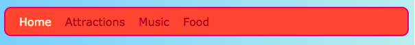

## Totul pe rând

Pe această carte veți afla câteva trucuri pentru aranjarea lucrurilor **orizontal** pe o pagină. În primul rând, veți vedea cum să obțineți chestii centrate. Apoi veți aranja elemente alături de rând.

+ Adăugați următoarele proprietăți CSS la clasa `.card`:

```css
    margin-stânga: auto; margin-dreapta: auto;
```

Ar trebui să vedeți că cărțile se mută în centrul paginii. Prin setarea marginilor din stânga și din dreapta la `auto`, puteți face orice element să fie în mijloc, în loc de peste la stânga.


+ Glisați marginea ferestrei browserului pentru a face ca pagina să fie mai îngustă și mai largă - observați că cartele rămân centrate.

+ Puneți toate legăturile de card pe care tocmai le-ați făcut într-un nou element de container. Nu va fi un `articol` sau `secțiunea`, dar unul numit `div`. Acesta este un container cu destinație generală pe care îl puteți utiliza pentru a grupa lucrurile și pentru a face niște machete frumoase.

```html
    <div class="cardContainer">
```

+ Adăugați următorul cod CSS în foaia de stil:

```css
    .cardContainer {display: flex; flex-wrap: folie; justify-content: spațiu-în jurul; padding: 10px; }
```

Voilà! Vă mulțumim pentru **Flex**, cardurile dvs. sunt acum afișate unul lângă celălalt!

+ Glisați marginea ferestrei pentru a face site-ul mai larg și mai îngust și urmăriți cum se deplasează cartelele pentru a se potrivi dimensiunii ferestrei, uneori înfășurându-se în linia următoare.


+ Încercați să ștergeți proprietățile `lățime` și `înălțime` din clasa `cărții` și să vedeți ce se întâmplă: `flex` se potrivește inteligent cărților împreună ca un puzzle, păstrând o înălțime uniformă peste tot ceea ce se află în același rând.


Dacă aveți un meniu de navigare în partea de sus a paginii dvs., acesta este un alt loc unde puteți folosi acest truc. Meniul dvs. trebuie să fie compus din elemente de listă ((`li`) pentru acest bit următor. Dacă preferați, puteți să-l încercați cu site-ul meu.

+ Găsiți regulile CSS pentru meniu. În site-ul meu, sunt blocurile `nav ul`, `nav ul li`și `nav ul li li a`.

+ Ștergeți afișarea proprietății `: în linie;` din elementele listate. Apoi, în lista `nav ul`, adăugați:

```css
    afișaj: flex; justify-content: flex-start;
```



Încheie cu aproape același meniu, nu? Lucrul cool despre `flex` este că puteți controla aspectul cu proprietatea `justify-content`.

+ Modificați valoarea `justify-content` la `flex-end` și vedeți ce se întâmplă. Sau schimbați-l la `spațiu-în jurul valorii de` pentru a face ca elementele de meniu să fie distanțate uniform, la fel ca în cazul cărților.


**`flex`** este un instrument destul de puternic de aspect care ar putea umple o serie întreagă de Sushi Card propriu - puteți afla mai multe despre el la [dojo.soy/html3-flex](http://dojo.soy/html3-flex).