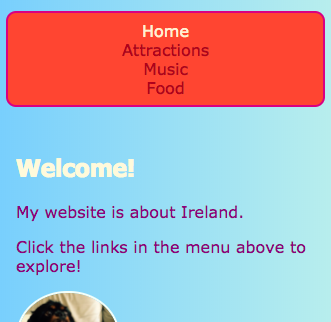
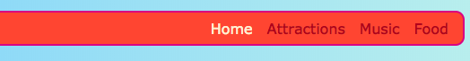

## Asigurați-vă că meniul dvs. este receptiv

Un **receptiv** site - ul web este una care se adaptează la dimensiunea ecranului , astfel că întotdeauna arată foarte bine, dacă te uiți la ea pe un computer, telefon mobil sau tableta. Să facem meniul dvs. receptiv!

Vei începe cu stiluri regulate: acest lucru va fi dvs. **implicit** comportament.

## \--- colaps \---

## titlu: Ce înseamnă "implicit"?

Stilurile implicite reprezintă setul dvs. normal de reguli de stil. Acestea sunt aplicate indiferent de ce, înainte de a verifica orice condiții speciale.

Puteți adăuga un cod care apoi verifică dimensiunea ecranului și face unele ajustări dacă este necesar.

\--- / colaps \---

+ Adăugați următoarele reguli CSS în meniul dvs. Probabil că aveți și culori și granițe definite; Le-am lăsat să economisească spațiu aici! Dacă aveți deja definit reguli CSS pentru meniul dvs., trebuie doar să adăugați sau să modificați proprietățile și valorile de mai jos care lipsesc.

```css
    nav ul {umplutură: 0,5; afișaj: flex; direcție flexibilă: coloană; } nav ul li {text-aliniere: centru; listă-tip: none; margin-dreapta: 0,5; margin-stânga: 0,5; }
```

Cu codul CSS de mai sus, meniul dvs. va fi cel mai potrivit pentru ecrane mici. Aceasta se numește **mobilă-prima**.



## \--- colaps \---

## titlu: Ce înseamnă "mobil-prima"?

Destul de des atunci când codați un site web, veți folosi un ecran de computer și probabil veți defini stilurile dvs. în funcție de modul în care arată pe ecranul respectiv.

Când codificați mai întâi pentru mobil, în locul dvs. alegeți stiluri implicite, care sunt potrivite pentru ecrane mici, cum ar fi smartphone-uri. Apoi adăugați cod suplimentar pentru a face ajustări pentru ecrane mai mari.

Deoarece din ce în ce mai mulți oameni navighează pe internet pe smartphone-urile sau comprimatele lor, nu pe un computer, este o practică bună să vă dezvoltați site-ul în acest sens.

\--- / colaps \---

+ Acum adăugați următorul cod în foaia de stil:

```css
    @media toate și (min-lățime: 1000px) {nav ul {flex-direction: row; justify-content: spațiu-în jurul; }}
```

Prima linie de cod de mai sus verifică ce mărime este fereastra browserului. Dacă fereastra are **1000 pixeli** sau mai mult, se aplică toate regulile de stil din interiorul blocului.


## \--- colaps \---

## titlu: Cum funcționează?

Blocul conține valori noi numai pentru anumite proprietăți ale meniului `nav ul`.

Ori de câte ori fereastra este mai mare de 1000 de pixeli, aceste valori noi vor fi aplicate în locul celor deja definite pentru `nav ul`.

Restul proprietăților pe care le-ați definit anterior pentru `nav ul` va rămâne același.

\--- / colaps \---

+ Dacă utilizați Trinket pentru a scrie cod, ar putea fi util să descărcați proiectul, astfel încât să îl puteți testa pe un ecran de dimensiune completă.

\--- provocare \---

## Provocare: aduceți-vă meniul să se ajusteze pentru ecrane mari

+ Puteți adăuga un alt bloc pentru ecrane mai mari de **1600 pixeli**, cu `flex-end` în loc de `spațiu-în jurul valorii de`?



\--- sugestii \---

\--- hint \---

Următorul cod definește proprietățile flexibile pentru elementele de meniu atunci când ecranul este mai mare de 1600 de pixeli:

```css
    @media toate și (min-lățime: 1600px) {nav ul {flex-direction: row; justify-content: flex-end; }}  
```

\--- / indiciu \---

\--- / sugestii \---

\--- /provocare \---

Puteți pune orice reguli CSS doriți în blocuri ca acestea pentru a defini diferite stiluri pentru diferite dimensiuni ale ecranului. Va fi deosebit de util atunci când faci machete de grilă CSS mai târziu!