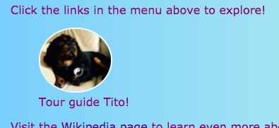

## Subtitrări și note

Pe acest card veți afla mai multe despre încă două tipuri de element **container** : unul pe care îl puteți utiliza pentru a adăuga o imagine (oarecum text ca titlu sau scurtă descriere) unei imagini și altul pentru că aveți alte lucruri care nu într-adevăr, aparțin informațiilor principale de pe o pagină.

### Imagini cu legende

+ Găsiți un element `img` în care aveți text deasupra sau dedesubt care se referă la imagine. Sunt de lucru cu imaginea lui Tito la `index.html`, dar poti sa te duci cu tot ce este pe site - ul dumneavoastră. 

```html
            
  <p>
    Ghid turistic Tito!
  </p>
```

+ Pe linia de deasupra codului, adăugați eticheta de deschidere `<figure>`. On a new line below the code, place the closing tag `</figure>`.

+ Next, remove the `p` tags, or whatever tags you have around the text (maybe it's a heading, like `h2`?), and put the text in between `<figcaption> </figcaption>` tags instead. Totul ar trebui să pară așa:

```html
  <figure>
                
      <figcaption>
      Ghid turistic Tito!
      </figcaption>
  </figure>
```

Elementul `figcaption` este **legendă**. Se poate trece deasupra elementului `img` sau sub el.



## \--- colaps \---

## titlu: De ce este util acest lucru?

`figura` elementul acționează ca un fel de **container** pentru imaginea și legenda sa. Acest lucru vă permite să le tratați ca o unitate la definirea stilurilor.

Gruperea acestora împreună logic ajută la menținerea unei structuri bune în codul site-ului dvs. web.

\--- / colaps \---

Puteți utiliza codul CSS la stil `figura` și `figcaption` ca și orice alt element care utilizează clase, ID-uri sau selectori de elemente. Adăug următoarele reguli pentru a elimina spațiul suplimentar adăugat de noul container:

```css
  figura {margin-top: 0px; margin-bottom: 0px; margin-left: 0px; margin-right: 0px; }
```

### Notele laterale

Pagina Atracții de pe site-ul meu este o listă cu locurile de vizitat. Vreau să adaug câteva note despre vreme și despre cum să ajung. Aceste informații nu aparține cu adevărat în `articolul` elementul cu toate atracțiile. Acesta este un exemplu în care puteți folosi elementul `lângă`.

+ Du - te la o pagină de pe site - ul care are un `articol` element de pe ea - Sunt folosind `attractions.html`.

+ **Outside** of the `article` element, add one or more pairs of `<aside> </aside>` tags containing your extra stuff.

```html
  <aside class="sideNoteStyle">
      <h2>Noțiuni de bază</h2>
      <h3>Tren și autobuz</h3>
      <p>Puteți ajunge în majoritatea orașelor importante cu trenul de la Dublin. Există multe autobuze care fac excursii la locații populare și atracții turistice.</p>
      <h3>Mașină</h3>
      <p>Cea mai ușoară modalitate de a ajunge în afara orașelor este cu mașina.</p>
    </aside>
    <aside class="sideNoteStyle">
      <h2>Vremea</h2>
      <p>Vremea în Irlanda este de <span class="specialText">foarte imprevizibile!</span> Este cel mai bine să <span class="specialText">fie pregătite</span> pentru orice fel de vreme, chiar dacă este o zi bună!</p>
  </aside>
```

## \--- colaps \---

## titlu: De ce este util acest lucru?

Articolele `,`, `,`și alte recipiente sunt similare. Singura diferență reală este în **sensul**, adică, ceea ce le utilizați pentru.

Este important să utilizați elemente HTML relevante ori de câte ori puteți. Acesta oferă site - ul mai bine dvs. structura și este util mai ales pentru persoanele care folosesc **cititoare de ecran**.

\--- / colaps \---

Ați văzut celălalt element acolo, `span`? Aceasta este o etichetă specială pe care o puteți folosi doar pentru adăugarea unui cod suplimentar CSS! Puteți pune ceva între o pereche de taguri `span`. Este util pentru lucruri precum styling-ul **parte** a textului într-un paragraf.

+ Adăugați următorul cod CSS în foaia de stil pentru a finaliza stilul pentru codul HTML de mai sus.

```css
  .sideNoteStyle {margine: punctată 1px violet; fundal-culoare: # c1ebec; umplutură: 0,5 mm; margine: 0,5; } .specialText {culoare: # FF4500; font-size: mai mare; }
```


Pe următoarea carte, veți învăța cum să faceți aspectul site-ului dvs. mai interesant!

+ Pentru a fi gata, să facă o pagină care are un `articolul` și două `deoparte` elemente din interiorul `<main> </main>` tag - uri. Sau, dacă preferați, puteți lucra cu pagina Atracții de pe site-ul meu.