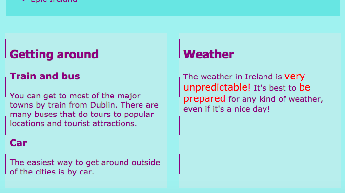

## Proiectați machete de pagini răcoroase

+ Pentru acest card ar trebui să lucreze cu o pagină care conține un `principal` element de trei elemente de interior: un `articol` și două `deoparte`s. Continuați și creați-le mai întâi dacă aveți nevoie. Dacă doriți să lucrați cu site-ul meu, adăugați codul `` din cardul Sushi anterior la pagina Atracții. 

Iată trei machete de pagini diferite pe care le veți aplica:


+ Adăugați noi clase CSS la `principal` și fiecare din cele trei elemente din interiorul acestuia.

```html
    <main class="attPageLayoutGrid">
        <article class="attGridArticle">
            <- alte lucruri aici ->
        </article>
        <aside class="attGridAside1">
            <- alte lucruri aici ->
        </aside>
        <aside class="attGridAside2">
            <- alte lucruri aici ->
        </aside>
    </main>
```

Containerul va schimba aspectul este `principal`, dar ai putea face acest lucru cu orice fel de container, cum ar fi un `div` sau `articol`, sau chiar întreaga pagina `corpul`. Tehnica vei folosi este numit **grila CSS**.

În acest exemplu, `antet` și `subsol` va fi lăsat în afara designului, dar este destul de comună pentru a le include în grila de asemenea.

+ Setați proprietatea `afișare` la `grilă` pe containerul general:

```css
    .attPageLayoutGrid {afișare: grilă; grilă-grilă: 0,5 mm; grilă-decalaj: 1em; }
```

Ce credeți că fac proprietățile `grid-column-gap` și `grid-row-gap`?

+ Apoi, numiți o zonă `rețea` pentru fiecare element: 

```css
    .attGridArticle {grid-area: agArticle; } .attGridAside1 {zona grid-ului: agAside1; } .attGridAside2 {zona grid-ului: agAside2; }
```

Apoi, proiectați aspectul dvs.! Să pună două `deoparte` parte elemente de partea în partea de jos a paginii. Pentru aceasta aveți nevoie de două **coloane** de lățime egală. Puteți păstra **rândul** înălțimea automată.

+ Introduceți următorul cod în regulile CSS `.attPageLayoutGrid`:

```css
    grilă-șablon-rânduri: auto; grilă-șablon-coloane: 1fr 1fr; grilă-șablon-zone: "agArticle agArticle" "agAside1 agAside2";
```

`fr` reprezintă **fracție**. Observați cum a face `articolul` ia tot spațiul de deasupra celor două coloane.

## \--- colaps \---

## titlu: Ajutor! Am erori și avertismente!

Dacă utilizați Trinket, este posibil să observați unele erori și avertismente, chiar dacă ați introdus exact codul de mai sus. Acest lucru se datorează faptului că Trinket nu recunoaște încă proprietățile rețelei CSS. Cu toate acestea, codul va funcționa în continuare.

În cazul în care codul de rețea CSS vă oferă avertismente privind "proprietatea necunoscută" sau o eroare cum ar fi "simbolul neașteptat 1fr", puteți pur și simplu ignora aceste.

\--- / colaps \---



Să punem `deoparte` elemente peste pe dreapta și a le face jumătate din lățimea de `articolul`.

+ Modifica valorile `grid-șablon coloanele` și `grid-matriță domenii` până la:

```css
    grilă-șablon-coloane: 2fr 1fr; grilă-șablon-zone: "agArticle agAside1" "agArticle agAside2";
```


+ Dacă nu doriți `deoparte` elemente pentru a întinde tot drumul spre partea de jos, puteți adăuga un spațiu liber , utilizând un punct: 

```css
    grilă-șablon-zone: "agArticle agAside1" "agArticle agAside2" "agArticle. „;
```


\--- provocare \---

## Provocare: realizați diferite machete pentru diferite dimensiuni ale ecranului

+ Puteți utiliza verificările dimensiunii ecranului pe care le-ați adăugat mai devreme pentru a modifica aspectul în funcție de cât de mare este ecranul? Notă: dacă ați creat deja blocuri CSS pentru fiecare dimensiune a ecranului, puteți adăuga noul cod CSS la acele blocuri în loc să creați altele noi.

\--- sugestii \---

\--- hint \---

Următorul cod definește un aspect pentru clasa CSS de mai sus atunci când ecranul este mai mare de 1000 de pixeli:

```css
    @media toate și (min-width: 1000px) {.attPageLayoutGrid {grid-template-coloane: 1fr 1fr; grilă-șablon-zone: "agArticle agArticle" "agAside1 agAside2"; }}  
```

\--- / indiciu \---

\--- hint \---

Următorul cod definește un aspect pentru clasa CSS de mai sus atunci când ecranul este mai mare de 1600 de pixeli:

```css
    @media all și (min-width: 1600px) {.attPageLayoutGrid {grid-template-coloane: 1fr 1fr; grilă-șablon-zone: "agArticle agAside1" "agArticle agAside2" "agArticle."; }}  
```

\--- / indiciu \---

\--- / sugestii \---

\--- /provocare \---

Cu **grilă CSS**, puteți face aproape orice aspect care vă place. Dacă doriți să aflați mai multe, accesați [dojo.soy/html3-css-grid](http://dojo.soy/html3-css-grid){: target = "_ blank"}