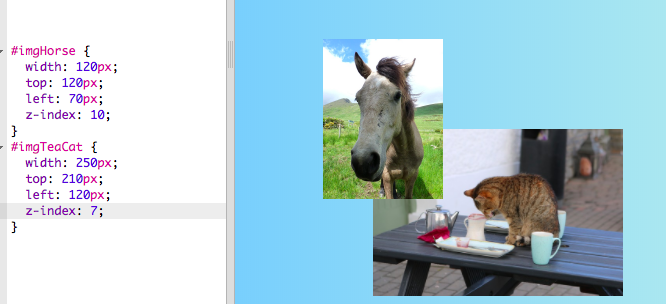

## colaj foto

Pe acest card veți învăța să utilizați CSS pentru a poziționa exact elementele HTML și pentru a crea un colaj de fotografie.


+ Adăugați `div` la pagina dvs. și plasați cât mai multe imagini în ea, după cum doriți. Dați valorile `div` și `img` elemente `id`.

```html
    <div id="photoBox" class="relPos">
        
        
    </div>
```

Fotografiile vor apărea unul după celălalt pe pagina web, în ​​ordinea în care apar în codul dvs.

+ În fișierul dvs. CSS, adăugați următoarea clasă CSS pentru elementele din cadrul diviziei `div`: 

```css
    .absPos {poziție: absolută; }
```

+ Apoi, trebuie să adăugați poziția proprietății `: relativă;` la container și definiți o dimensiune pentru acesta. Acest lucru face ca pozițiile celorlalte elemente să fie definite **față de** (adică în interiorul) containerului.

```css
    .relPos {poziție: relativă; } #photoBox {width: 800px; înălțime: 400px; }
```

+ Apoi creați un set de reguli de stil pentru fiecare dintre elementele care utilizează selectori **id** pentru a seta dimensiunile acestora (`lățimi` și / sau `înălțime` proprietăți), precum și pozițiile lor exacte.

Pentru a defini poziția unui element, există patru proprietăți pe care le puteți utiliza: `stânga`, `dreapta`, `partea superioară`și `partea de jos`. Acestea reprezintă cât de departe fiecare margine ar trebui să fie de la marginea părintelui. Utilizați fie `partea inferioară` sau `inferioară` pentru poziția verticală, fie `stânga` sau `dreapta` pentru poziția orizontală.


+ Alegeți pozițiile exacte pentru fiecare dintre imaginile dvs. și utilizați oricare dintre proprietățile `stânga`, `dreapta`, `partea superioară`și `partea de jos` pentru a defini acele poziții din regulile dvs. CSS. De exemplu, acest cod plasează imaginea de pisică la 100 de pixeli din partea de sus și 60 de pixeli din stânga:

```css
    #imgTeaCat {width: 250px; top: 100px; stânga: 60px; }
```

Notă: Valorile poziției pot fi de asemenea negative! Dacă utilizați o valoare negativă, aceasta va împinge elementul în afara containerului, peste orizontul pe care l-ați specificat.

### A face lucrurile să se suprapună

S-ar putea să doriți să se suprapună câteva imagini. Dar cum alegi care dintre ele merge în top?

+ Alegeți două imagini și le dați poziții care le determină să se suprapună.

+ Adăugați o proprietate suplimentară, `z-index: 10;` la unul dintre ele, apoi adăugați `z-index: 7;` la cealaltă.

+ Aruncați o privire asupra rezultatului pe pagina dvs. web.



+ Acum schimbați valorile `z-index` , astfel că cele `7` și `10` sunt invers. Vedeți vreo diferență în pagina dvs. web?


## \--- colaps \---

## titlu: Cum funcționează z-indexul?

Proprietatea `z-index` vă permite să decideți cum ar trebui să se suprapună două sau mai multe elemente. Valoarea poate fi orice număr întreg.

Elementul cu **cel mai mare de** număr se termină pe **top** al grămezii, sau cu alte cuvinte , la foarte **frontală**. Elementul cu următorul număr cel mai mare este în spatele acestuia și în fața celorlalți și așa mai departe, până când ajungeți la elementul cu cel mai mic număr, care apare la spate în spatele tuturor celorlalte elemente.

\--- / colaps \---

Puteți poziționa astfel orice elemente HTML, nu doar imagini. De exemplu, puteți utiliza un element `p` pentru a adăuga un text pe o fotografie.

\--- provocare \---

## Provocare: faceți un colaj de fotografie

+ Încercați să creați propriul dvs. colaj de fotografii, cum ar fi cel prezentat mai jos! Utilizați poziționarea exactă împreună cu diferite valori `z-index` pentru a obține efectul de suprapunere așa cum doriți.

\--- sugestii \---

\--- hint \---

Mai jos este codul HTML pentru colajul de fotografie de pe site-ul meu din Irlanda. Există șase fotografii și o bucată de text în interiorul unui `div`.

```html
    <div id="photoBox" class="relPos">
        
        
        
        
        
        
        <p id="photoText" class="absPos">Irlanda</p>
    </div>
```

\--- / indiciu \---

\--- hint \---

Iată regulile CSS care stabilesc pozițiile pentru fiecare dintre fotografiile mele din colaj:

```css
    #imgMai mult {width: 120px; top: 200px; stânga: 390px; z-index: 10; } #imgSeep {width: 200px; top: 100px; stânga: 20px; z-index: 8; } #imgCoast {width: 150px; top: 250px; stânga: 10px; z-index: 5; } #imgTrees (lățime: 110px; top: 65px; stânga: 205px; z-index: 9; } #imgTeaCat {width: 250px; top: 210px; stânga: 160px; z-index: 7; } #imgStreet {width: 180px; top: 90px; stânga: 310px; z-index: 6; } #photoText {font-family: "script de perie MT"; culoare: verde deschis; font-size: 4m; stânga: 35px; top: 15px; z-index: 20; }
```

\--- / indiciu \---

\--- hint \---

Iată clasele CSS pe care le-am folosit:

```css
    .collagePhoto {border: 1px solid white; } .relPos {position: relative; } .absPos {position: absolute; }
```

\--- / indiciu \---

\--- / sugestii \---


\--- /provocare \---