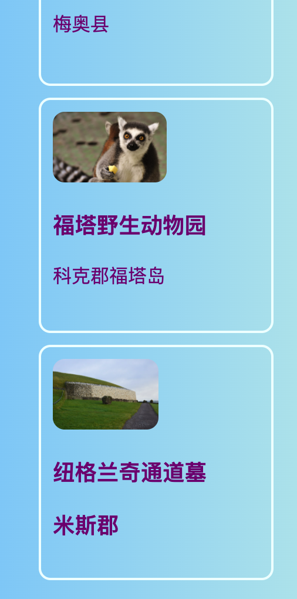
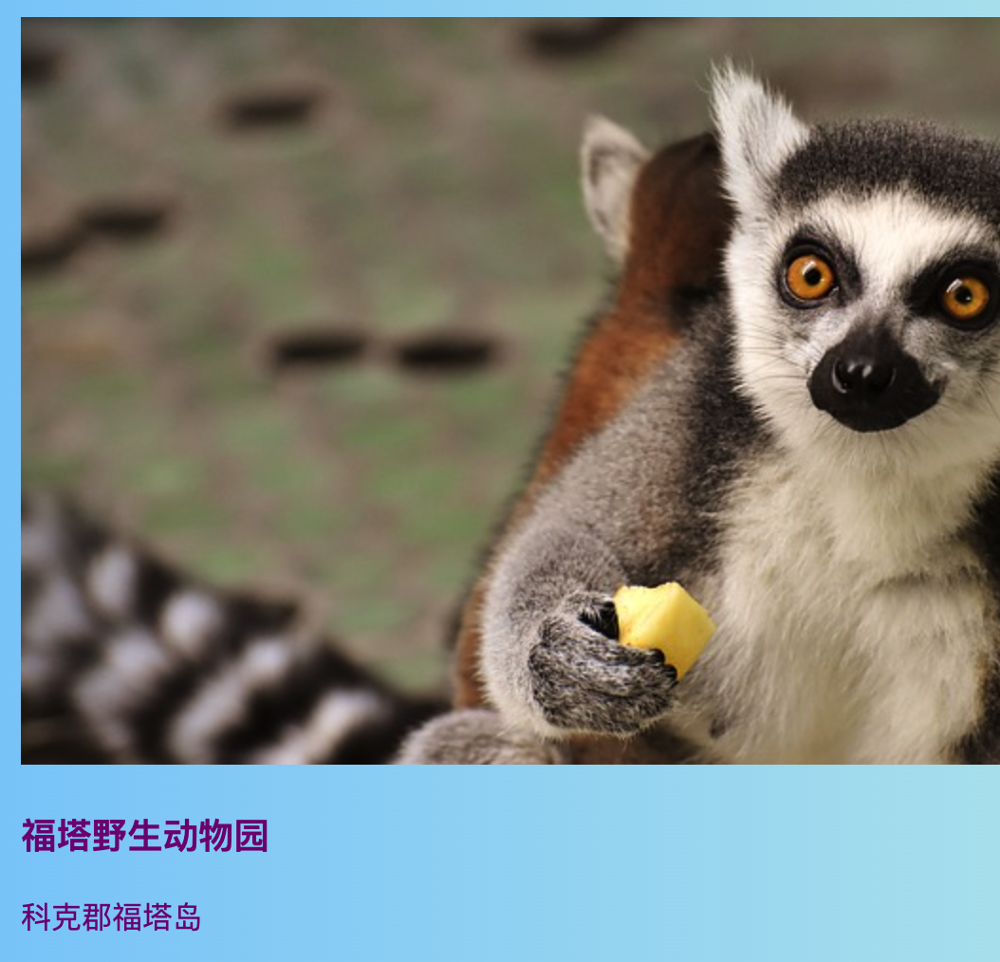
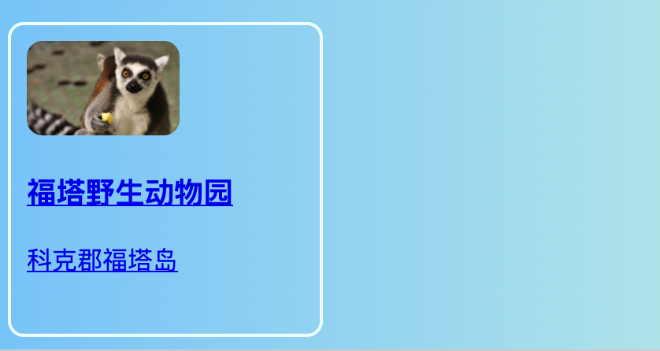
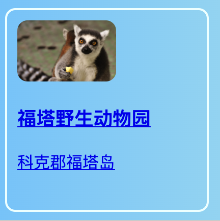

## 可点击的卡片

这是一种可以用来制作相册或用于展示项目的投资组合页面的技术:**预览卡**.



+ 在您喜欢的任何地方，将以下HTML代码添加到您的网站。 我把它加在`index.html`. 您可以更改图片和文本以适合您自己的预览卡。 我将为爱尔兰的旅游景点做一批亮点。

```html
    <article class="card">
        
        <h3>佛塔野生动物园</h3>
        <p>科克郡佛塔岛</p>
    </article>
```



+ 添加以下CSS代码以创建类`card` 和 `tinyPicture`:

```css
    .tinyPicture {
        height: 60px;
        border-radius: 10px;
    }
    .card {
        width: 200px;
        height: 200px;
        border: 2px solid #F0FFFF;
        border-radius: 10px;
        box-sizing: border-box;
        padding: 10px;
        margin-top: 10px;
        font-family: "Trebuchet MS", sans-serif;
    }
    .card:hover {
        border-color: #1E90FF;
    }
```



让我们将整个预览卡变成一个链接，以便人们单击以查看更多信息。

+ 将整个 `article`元素放在链接元素中。 确保结束 `</a>`标签在结束`</article>` 标签之后! 随意将链接**URL**更改为您想要链接的任何内容。 那可能是您网站上的另一个页面，或者可能完全是另一个网站。

```html
    <a href="attractions.html#scFota">  
        <article class="card ">
            
            <h3>佛塔野生动物园</h3>
            <p>科克郡佛塔岛</p>
        </article>
    </a>
```



## \--- collapse \---

## 标题：链接到页面的特定部分

注意` href`的值如何在我的链接中以` #scFota` 结尾？ 这是一个巧妙的技巧，可用于跳转到页面的特定部分。

+ 首先，键入要链接到的页面的URL，然后输入`＃ ` 。

+ 在要链接到的页面的代码文件中，找到要跳转到的部分，并为该元素提供一个` id ` ，例如`<section id =“ scFota” ` 。 `id`的值是您在链接中输入的`#`之后。

\--- /collapse \---

## \--- collapse \---

## 标题：重置样式

既然整个预览卡是一个链接，文本字体可能已更改。

+ 如果是，您可以通过添加一个 **CSS 类** 到链接中来修复它：`class="cardLink"`。 这是放在样式表中的CSS代码：

```css
    .cardLink {
        color: inherit;
        text-decoration: none;
    }
```

将任何属性的值设定为`继承`，使它使用了**parent**元素的值。 因此，在这种情况下，文本颜色将与主页上其余文本相匹配。

\--- /collapse \---

+ 至少制作四张或五张这些卡。 如果您使用我的示例网站，则可以对“景点”页面上的每个部分进行操作。 在下一张“寿司卡”上，您将学习如何通过有趣的技巧来安排卡！