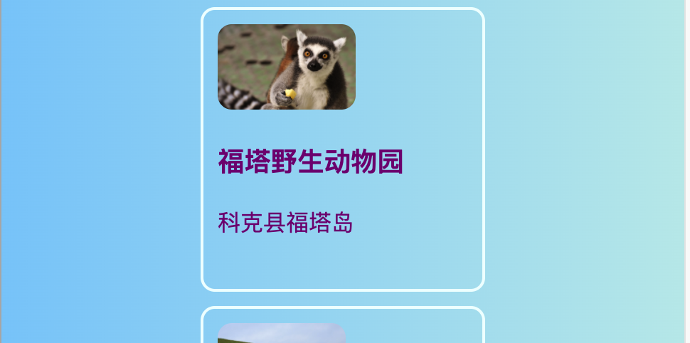
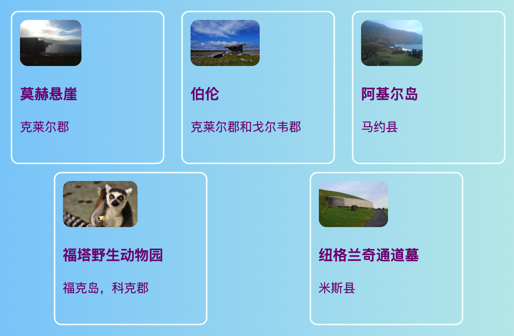
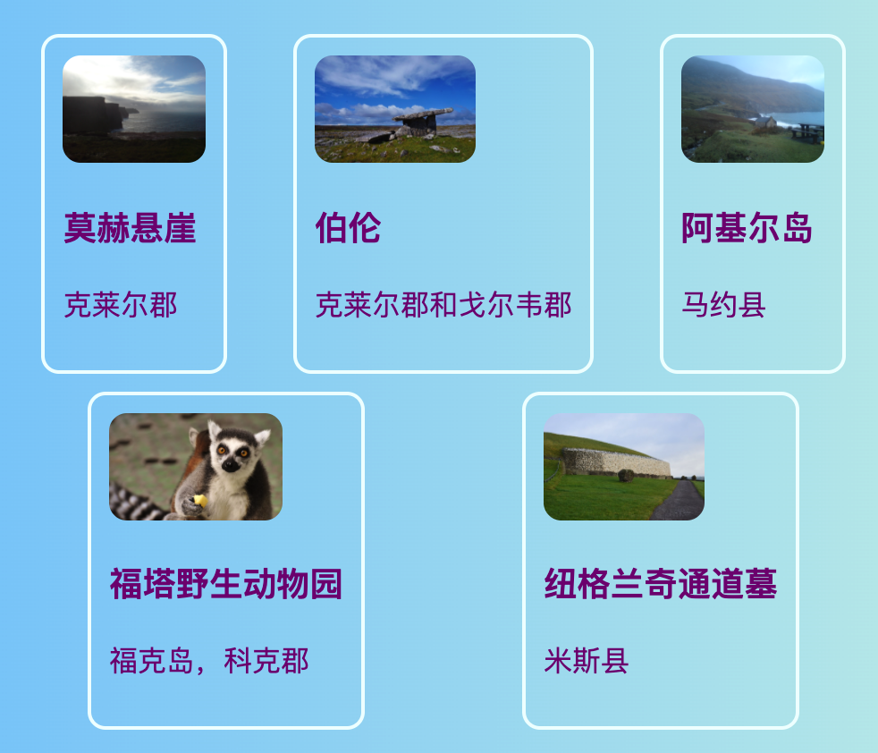
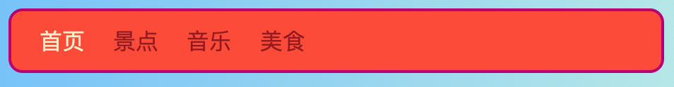
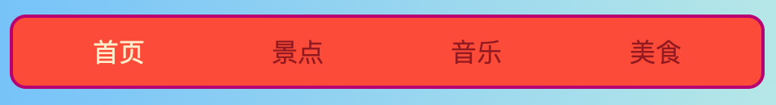
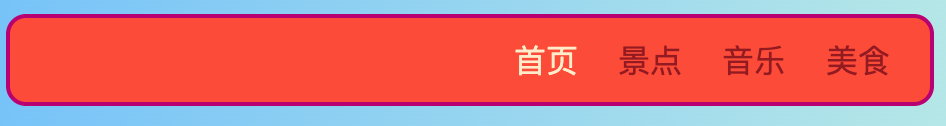

## 全部在一行

在这张卡片上，您将学习一些在页面上**水平**安排事物的技巧。 首先，您将了解如何使内容居中。 然后，您将并排排列元素。

+ 将以下CSS属性添加到` .card `类：

```css
    左边距：自动；
右边距：自动；
```

您应该看到卡片移动到页面的中央。 通过将左右边距设置为`自动` ，您可以使任何元素位于中间，而不是位于左侧。



+ 拖动浏览器窗口的边缘以使页面更窄和更宽-请注意，卡片保持居中。

+ 将您刚才创建的所有卡片链接放入一个新的容器元素中。 不会是`article`或`section` ，但一个叫` div ` 。 这是一个通用容器，可用于对事物进行分组和进行漂亮的布局。

```html
    <div class="cardContainer">
```

+ 在你的样式表中添加以下CSS代码：

```css
    .cardContainer {
        display: flex;
        flex-wrap: wrap;
        justify-content: space-around;
        padding: 10px;
    }
```

瞧！ 多亏了** Flex ** ，您的卡片现在可以并排显示！

+ 拖动窗口的边缘可以使网站变宽和变窄，并观察卡片如何移动以适合窗口大小，有时会绕到下一行。



+ 尝试删除` .card`类中`宽度`和`高度` 的属性，看看会发生什么：` flex `像拼图游戏一样巧妙地将卡片组合在一起，使同一行中的所有东西保持均匀的高度。



如果您在页面顶部有一个导航菜单，那是您可以使用这个技巧的另一个地方。 您的菜单需要包含列表元素(`li`)才能接下来进行此操作。 如果你喜欢，你可以尝试使用我的网站。

+ 找到菜单的CSS规则。 在我的网站上，那是`nav ul`、`nav ul li`和`nav ul li a`。

+ 从列表项中删除属性` display:inline; `。 然后，在列表` nav ul中` ， 加入：

```css
    display: flex;
    justify-content: flex-start;
```



您最终得到的菜单几乎相同，对吗？ 关于`flex`的很酷的事情是你可以用属性`justicify-content`控制布局。

+ 更改` justify-content`的值至` flex-end `看看会发生什么。 或将其更改为`space-around`使菜单项均匀分布，就像您制作卡片时一样。





**` flex `**是一个非常强大的布局工具，可以填满自己的整个Sushi Card系列-您可以在[ dojo.soy/html3-flex上了解有关它的更多信息](http://dojo.soy/html3-flex) 。