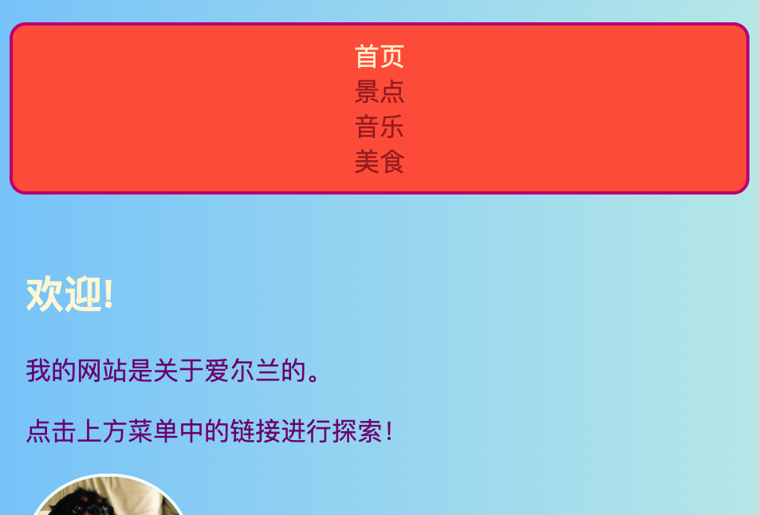
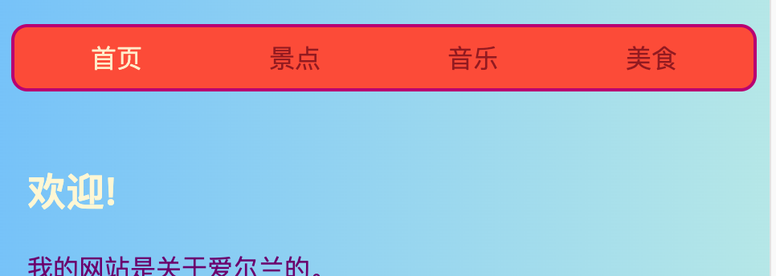
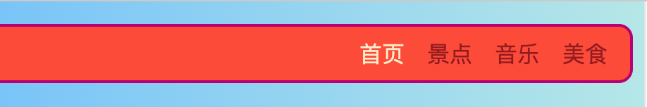

## 使您的菜单响应

一个**响应式**网站是一个根据屏幕大小调整的网站，这样它总是看起来很棒， 是否在电脑、手机或平板电脑上查看它。 让我们制作您的响应式菜单！

您将从常规样式开始：这是您的** 默认 **行为。

## \--- collapse \---

## 标题：“默认”是什么意思？

默认样式是您的常规样式规则集。 在检查任何特殊条件之前，无论如何都应用它们。

您可以添加代码，然后检查屏幕大小，并在必要时做一些调整。

\--- /collapse \---

+ 在您的菜单中添加以下CSS规则。 您可能还定义了颜色和边框。我省去了它们以节省空间！ 如果您已经为菜单定义了CSS规则，则只需添加或更改缺少的属性和值即可。

```css
    nav ul {
        padding: 0.5em;
        display: flex;
        flex-direction: column;
    }
    nav ul li {
        text-align: center; 
        list-style-type: none;
        margin-right: 0.5em;
        margin-left: 0.5em;
    }
```

使用上面的CSS代码，您的菜单将最适合小屏幕。 这称为** 移动优先 **开发。



## \--- collapse \---

## 标题：“移动优先”是什么意思？

在编写网站代码时，通常会使用计算机屏幕，并且可能会根据其在屏幕上的外观来定义样式。

当您为移动设备编写代码时，您将选择适合于小屏幕（例如智能手机）的默认样式。 然后，您添加额外的代码以针对更大的屏幕进行调整。

因为越来越多的人在他们的智能手机或平板电脑上而不是在电脑上浏览互联网， 考虑到这一点，开发您的网站会是一项很好的练习。

\--- /collapse \---

+ 现在，将以下代码添加到样式表中：

```css
    @media all and (min-width: 1000px) {
        nav ul {
            flex-direction: row;
            justify-content: space-around;
        }
    }
```

上面的第一行代码检查浏览器窗口的大小。 如果窗口是** 1000像素**或更多，它将应用块内的所有样式规则。



## \--- collapse \---

## 标题：它是如何工作的？

该块仅包含`nav ul`菜单中的一些属性的新值。

只要窗口宽于1000像素，就会应用这些新值，而不是您已经定义的` nav ul `值 。

您先前定义的`nav ul`的其余属性将保持不变。

\--- /collapse \---

+ 如果您正在使用Trinket编写代码，则下载项目可能会有所帮助，以便可以在全尺寸屏幕上对其进行测试。

\--- challenge \---

## 挑战：使您的菜单适应大屏幕

+ 您是否添加另一个块，为长度大于** 1600像素**的屏幕 ，使用` flex-end `而不是` space-around ` ？



\--- hints \---

\--- hint \---

下面的代码定义菜单项在屏幕大于1600像素时的 flex 属性：

```css
    @media all and (min-width: 1600px) {
        nav ul {
            flex-direction: row;
            justify-content: flex-end;
        }
    }  
```

\--- /hint \---

\--- /hints \---

\--- /challenge \---

您可以将所需的任何CSS规则放入此类块中，以针对不同的屏幕尺寸定义不同的样式。 当您稍后使用 CSS 网格布局时，它将特别有用！