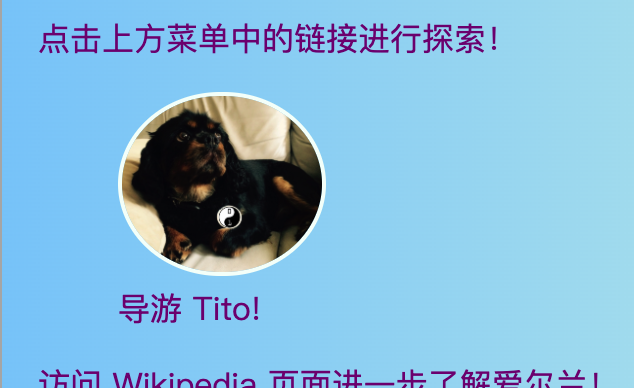
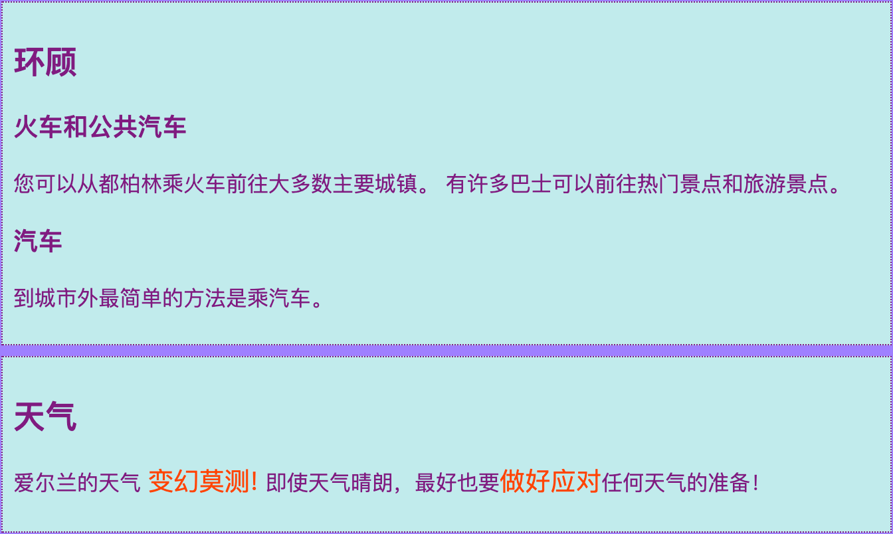

## 标题和边注

在这张卡上，您将了解到另外两种类型的**容器**元素：一种可用于在图片上添加标题（某些文本，例如标题或简短描述），另一种用于当您有多余的内容与页面上的主要信息不完全相关时。

### 带标题的图片

+ 在上方或下方带有文字的图片中查找` img `元素。 我正在使用` index.html `上的Tito图片 ，但您可以使用网站上的任何内容。 

```html
            
  <p>
    导游 Tito!
  </p>
```

+ 在代码上方的行上，添加开始标签`<figure>`。 在代码下方的新行上，放置结束标记` </figure>` 。

+ 接下来，删除` p` 标签，或删除文本周围的任何标签（可能是标题，例如` h2 ` ？），并将文本放在`<figcaption> </figcaption>之间`标签代替。 整个过程应如下所示：

```html
  <figure>
                
      <figcaption>
      导游 Tito!
      </figcaption>
  </figure>
```

`figcaption`元素是你的**caption**。 它可以在`img`元素上方或下方。



## \--- collapse \---

## 标题：为什么这个有用？

`figure`元素充当一种**container**为您的图片及其标题。 这允许您在定义样式时将他们作为一个单元来处理。

从逻辑上将它们分组在一起还有助于维护网站代码中的良好结构。

\--- /collapse \---

您可以使用 CSS 代码来风格`fig` 和 `figcaption` ，因为您将使用类、 ID或元素选择器的任何其他元素。 我要添加以下规则，以删除新容器添加的额外间距：

```css
  figure { 
      margin-top: 0px;
      margin-bottom: 0px;
      margin-left: 0px;
      margin-right: 0px;
  }
```

### 旁注

我网站上的景点页面是一个景点列表。 我想添加一些有关天气以及如何出行的注意事项。 该信息实际上并不属于`article`元素与所有景点。 这是你可以使用`aside`元素的一个例子。

+ 转到网站上具有`article`元素-我正在使用` attractions.html ` 。

+ **外部** ` article` 元素中，添加一对或多对`<aside> </aside>`包含您多余内容的标签。

```html
  <aside class="sideNoteStyle">
      <h2>出行</h2>
      <h3>火车和公共汽车</h3>
      <p>您可以从都柏林乘火车前往大多数主要城镇。 有许多巴士可以前往热门景点和旅游景点。 </p>
      <h3>车</h3>
      <p>最简单的出行方式是乘汽车。 </p>
    </aside>
    <aside class="sideNoteStyle">
      <h2>天气</h2>
      <p>爱尔兰的天气是<span class="specialText">非常难以预测！ </span>最好<span class="specialText">做好准备</span>无论天气如何，即使天气晴朗！ </p>
  </aside>
```

## \--- collapse \---

## 标题：为什么这个有用？

`aside`, `article`, 以及其他容器都是类似的。 唯一真正的区别是**含义** ，即它们的用途。

重要的是尽可能使用有意义的 HTML 元素。 它为您的网站提供了更好的结构，并且对使用**屏幕阅读器**的人特别有用。

\--- /collapse \---

您是否在其中发现了另一个元素，`span` ？ 这是一个特殊的标记，您可以将其用于添加额外的CSS代码！ 您可以将任何内容放在一对`span`标签之间。 它对某一段中的文本的 **part ** 非常有用。

+ 将以下CSS代码添加到样式表中，以完成上述HTML代码的样式。

```css
  .sideNoteStyle {
    border: dotted 1px purple;
    background-color: #c1ebec;
    padding: 0.5em;
    margin: 0.5em;
  }
  .specialText {
      color: #FF4500;
      font-size: larger;
  }
```



在下一张卡片上，您将学习如何使您网站的布局更加有趣！

+ 为了做好准备，请创建一个页面，其中有一个`article` 和两个`aside ` 标签在 `<main> </main>之间`。 或者，如果您愿意，可以使用我网站上的景点页面。