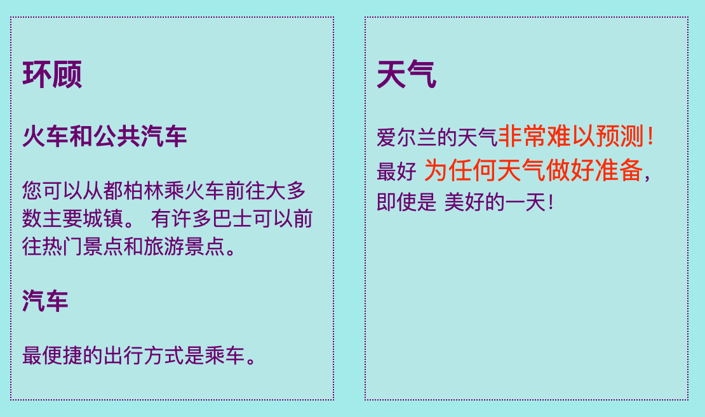
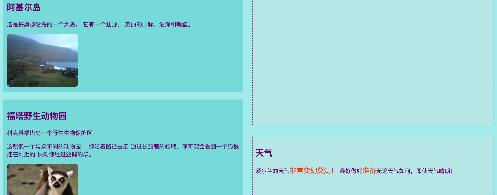
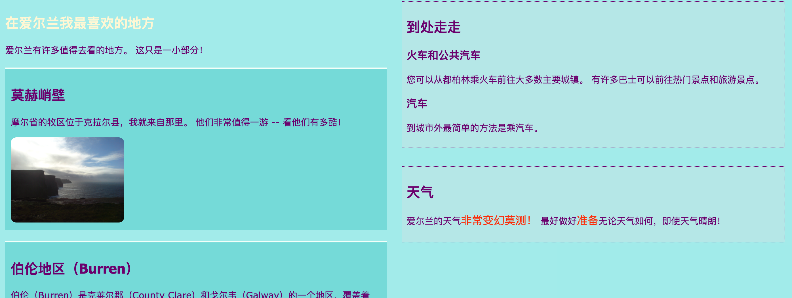

## 设计漂亮的页面布局

+ 对于这张卡片，您应该使用一个包含三个元素的 `main` 元素的页面：一个`article` 和两个`aside`. 如果需要，请先创建这些。 如果您想要与我的网站合作，请从上一张Sushi卡添加`aside`代码到Attraction页面。 

这里有三个不同的页面布局：


+ 将新的 CSS 类添加到 `main` 以及其中的三个元素。

```html
    <main class="attPageLayoutGrid">
        <article class="attGridArticle">
            <!--other stuff here-->
        </article>
        <aside class="attGridAside1">
            <!--other stuff here-->
        </aside>
        <aside class="attGridAside2">
            <!--other stuff here-->
        </aside>
    </main>
```

您要更改其布局的容器是` main ` ，但是您可以使用任何类型的容器（例如` div `或` article ` ，甚至整个页面` body ` 。 您将要使用的技术称为** CSS网格** 。

在这个例子中，`header`和`footer`将被排除在设计之外，但将它们也包括在网格中是很常见的。

+ 设置` display `属性到` grid `在整个容器上：

```css
    .attPageLayoutGrid {
        display: grid;
        grid-column-gap: 0.5em;
        grid-row-gap: 1em;
    }
```

您如何看待` grid-column-gap `和` grid-row-gap `属性吗？

+ 接下来，你为每个元素命名一个`grid-area` 

```css
    .attGridArticle {
        grid-area: agArticle;
    }
    .attGridAside1 {
        grid-area: agAside1;
    }
    .attGridAside2 {
        grid-area: agAside2;
    }
```

然后你设计你的布局！ 让我们将两个`aside`元素并排在页面底部。 为此，您需要两个** 列 **宽度相等。 您可以保留**行**高度自动。

+ 将以下代码放入` .attPageLayoutGrid中` CSS规则：

```css
    grid-template-rows: auto;
    grid-template-columns: 1fr 1fr;
    grid-template-areas: 
        "agArticle agArticle"
        "agAside1 agAside2";
```

` fr `代表** fraction ** 。 注意如何制作` article `占用两列的所有空间。

## \--- collapse \---

## 标题：帮助 ！ 我收到错误和警告！

如果您正在使用Trinket，您可能会发现一些错误和警告出现，即使您输入的代码与上面完全相同。 这是因为Trinket尚无法识别CSS网格属性。 然而，该守则仍然有效。

如果CSS网格代码为您提供“未知属性”警告或类似“意外令牌1fr”的错误，则可以将其忽略。

\--- /collapse \---



让我们将`aside`元素放在右侧，并使它们的宽度为`article`的一半 。

+ 更改` grid-template-columns `的值 和` grid-template-areas `至：

```css
    grid-template-columns: 2fr 1fr;
    grid-template-areas: 
        "agArticle agAside1"
        "agArticle agAside2";
```



+ 如果你不想让`aside`元素伸展至底部，你可以使用以下点添加空白空间： 

```css
    grid-template-areas: 
        "agArticle agAside1"
        "agArticle agAside2"
        "agArticle . ";
```



\--- challenge \---

## 挑战：为不同的屏幕大小设定不同的布局

+ 您能使用您早些时候添加的屏幕大小检查来根据屏幕宽度改变布局吗？ 注意：如果您已经为每个屏幕大小创建了 CSS 块 您可以将新的 CSS 代码添加到这些块，而不是创建新块。

\--- hints \---

\--- hint \---

下面的代码定义了屏幕大于 1000 像素的 CSS 类的布局：

```css
    @media all and (min-width: 1000px) {
        .attPageLayoutGrid {
            grid-template-columns: 1fr 1fr;
            grid-template-areas: 
                "agArticle agArticle"
                "agAside1 agAside2";
        }
    }  
```

\--- /hint \---

\--- hint \---

下面的代码定义了屏幕大于 1600 像素的 CSS 类的布局：

```css
    @media all and (min-width: 1600px) {
        .attPageLayoutGrid {
            grid-template-columns: 1fr 1fr;
            grid-template-areas: 
                "agArticle agAside1"
                "agArticle agAside2"
                "agArticle .";
        }
    }  
```

\--- /hint \---

\--- /hints \---

\--- /challenge \---

使用 **CSS 网格**, 你可以制作几乎任何你喜欢的布局。 如果要了解更多信息，请转到[ dojo.soy/html3-css-grid ](http://dojo.soy/html3-css-grid) {：target =“ _ blank”}