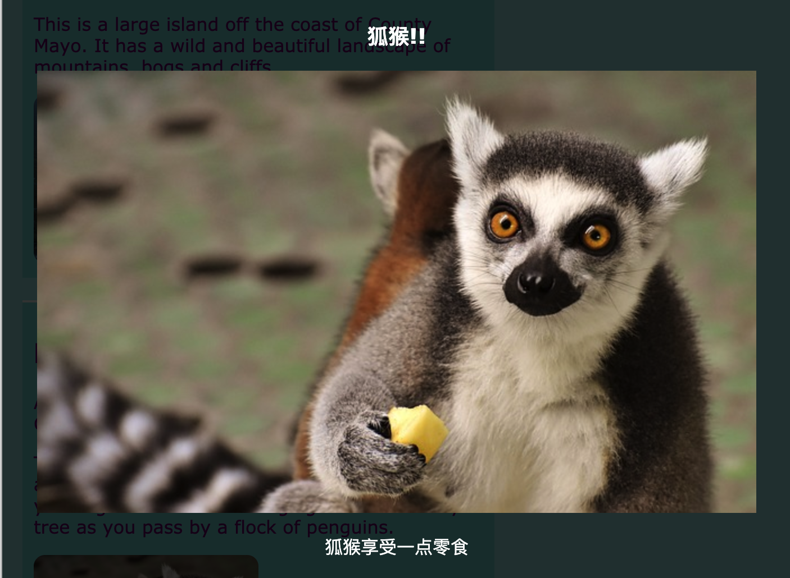

## 特殊效果。

在这张卡上，您将学到一些CSS可以达到的更好的效果。

### 阴影和运动

让我们在你先前制作的卡片上悬停光标时添加一点动作。

+ 查找早些时候的 `.card:hover` CSS 类，并将其更改为以下：

```css
    .card:hover {
        box-shadow: 0px 2px 2px rgba(0,0,0,0.2); 
        transform: translateY(-2px);
    }
```

+ 尝试在 ` translate ` 函数中不同的值！

## \--- collapse \---

## 标题：` transform `属性

如果您完成了中介HTML/CSS Sushi卡片，您可以记得在一些`@keyframes`动画中使用`transform`属性。 你在这里看到你也可以在常规的 CSS 块内自行使用该属性。

您可以将其设置为 ` rotate `，以使元素转弯。 其他是` translateY ` ，它可以上下移动内容，然后` translateX ` ，用于左右移动。

\--- /collapse \---

+ 在 `box-shadow` 属性上调整不同的像素值来查看它们做什么。 

## \--- collapse \---

## 标题：什么是 `rgba`？

`rgba(0,0,0,0.2)`是确定颜色的另一种方式。

它具有通常的三个数字（从` 0开始`到` 255 ` ）代表红色，绿色和蓝色。

第四个数字叫做**alpha**值，定义了**transpart**(或see-throug)是什么的。 这是一个十进制数字，介于`0`和`1`之间，`1`是根本看不到，而`0`则是完全看不到的。 这意味着一个元素的阿尔法值越低，它就越能看到。

\--- /collapse \---

+ 最后，先前将以下属性添加到`.card`类，从而使移动变得顺畅： 

```css
    transition: all 0.2s ease-out;
```

持续时间`0.2s`意味着`过渡`持续时间0.2秒。

### 灯箱

您在网站加载时可能看到的另一个效果是 **lightbox**：您点击某些东西，其他东西会变暗， 像一个更大的图片或弹出框一样，出现在所有东西的前面。



要获得这个效果，您将会创建两个链接：一个用于实际的灯箱(挂起的部分)， 和一件你点击来让灯箱出现的事情。 我要在我的网站的景点页面上做这个效果。 您可以在任何有图片的页面上做这个效果

+ 决定当你点击时你想要出现的东西， 并将它们全部添加到您的页面中，介于 `a ` 标签来创建链接。 请确保您给链接一个`id`。 代码可以在页面上的任何位置：您将在下一步中隐藏元素！

```html
    <a href="#_" class="lightbox" id="boxLemur">
        <h3>狐猴!! </h3>
        <2 />
        <p>狐猴享受一点零食</p>
    </a>
```

您可以在链接标记之间放置任何您喜欢的东西。 我有一张大图，一个标题和一些文字。 也许您只想要一张图片而没有文字！

+ 为灯箱添加以下CSS代码。 你能做些什么吗？

```css
    .lightbox{
        background: rgba(0,0,0,0.8);
        color: #ffffff;
        text-align: center;
        text-decoration: none;
        width: 100%;
        height: 100%;
        top: 0;
        left: 0;
        position: fixed;
        visibility: hidden;
        z-index: 999;
    }
```

注意：设置` position `属性固定为` fixed `表示您设置的位置将相对于浏览器窗口，因此在您滚动时它将保持不变。

+ 接下来，决定你想要点击什么来让灯箱出现， 并添加一对`a`的标签围绕那个元素添加一对（在我的情况下是一个小图片）。 链接的 **target** 将是灯箱，您使用的是`id`。 你可能会从早些时候认识到这种方法！

```html
    <a href="#boxLemur">
        
    </a>
```

+ 最后添加以下CSS代码。 请注意，这是一个**伪类** ;它应该放在` .lightbox`的代码之后类而不是里面！

```css
    .lightbox:target {
        visibility: visible;
    }
```

当灯箱成为最后一次点击链接的目标时，`:target` 伪类会被应用。 所以当您点击任何地方时，`可见性`将被恢复到`隐藏`。

+ 尝试点击您的新链接以查看灯箱！ 要使其消失，只需单击页面上的任意位置。

您可以向页面添加任意数量的灯箱。 他们都可以使用相同的 CSS 类 — 确保每个人都有不同的 `id` ！ 对于每一个人，你需要在你的网页上做一些东西，你可以点击来显示灯箱， 然后使用`id`作为该链接中的`href`值，就像你在上面所做的那样！